# ikas AI SEO Agent

**E-ticaret ürün içeriklerini otonom olarak analiz eden, skorlayan ve yeniden yazan AI ajan sistemi — maksimum SEO ve AI keşfedilebilirliği için.**

[ikas](https://ikas.com) mağazaları için geliştirildi. GraphQL API üzerinden bağlanır, her ürünü 100 puanlık bir rubrikle skorlar, ardından otonom bir AI pipeline ile zayıf alanları tespit eder, iteratif olarak yeniden yazar, iyileşmeleri doğrular ve önerileri kaydeder — ürün başına insan müdahalesi gerekmeden.

Full-stack web uygulaması: **React/TypeScript** frontend, **FastAPI** backend, **async SQLite** depolama.

---

## Problem

E-ticarette SEO optimizasyonu tekrarlayan, pahalı ve giderek yetersiz kalıyor. Her ürün için iyi bir başlık, zengin açıklama, doğru meta etiketleri, çok dilli içerik ve — AI arama çağında — ChatGPT, Perplexity ve Google AI Overviews'un alıntılayabileceği yapılandırılmış bilgiler gerekiyor.

Bunu yüzlerce ürün için manuel yapmak pratik değil. Tek bir AI prompt'u ile yapmak ise ölçülebilir kalite kontrolü olmayan, sıradan sonuçlar üretiyor.

## Çözüm

Bu ajan sadece içerik üretmiyor — **düşünüyor, skorluyor, yeniden yazıyor, doğruluyor ve iterasyon yapıyor**. Tıpkı bir insan SEO uzmanının yapacağı gibi, ama tüm kataloğunuz genelinde.

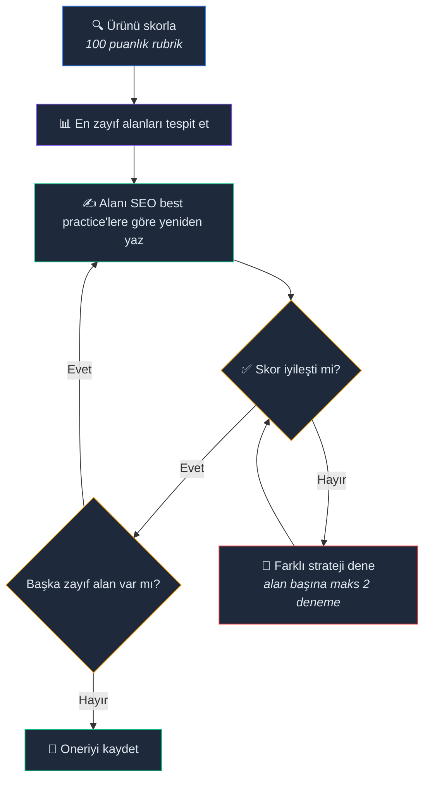

<p align="center"><i>Maks 8 otonom iterasyon — her yeniden yazım kabul edilmeden önce doğrulanır</i></p>

Sonuç: ölçülebilir, doğrulanmış SEO iyileştirmeleri — "AI üretimi metin" değil.

---

## Temel Yetenekler

### Otonom SEO Optimizasyonu

AI tek seferlik istek/cevap yapmıyor. **Tool calling** ile otonom olarak skorla → yeniden yaz → doğrula → tekrarla döngüsü çalıştırıyor. Her yeniden yazım, kabul edilmeden önce skorlama rubriğine karşı kontrol ediliyor. İyileşme yoksa ajan farklı bir yaklaşım deniyor — alan başına 2, toplamda 8 iterasyona kadar.

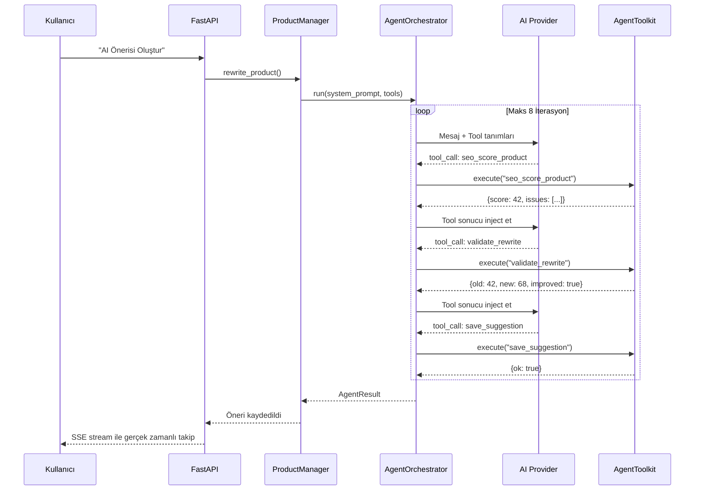

### 100 Puanlık SEO Skorlama Motoru

Ahrefs, Semrush, Yoast, Moz ve Screaming Frog'dan ilham alan kural tabanlı rubrik:

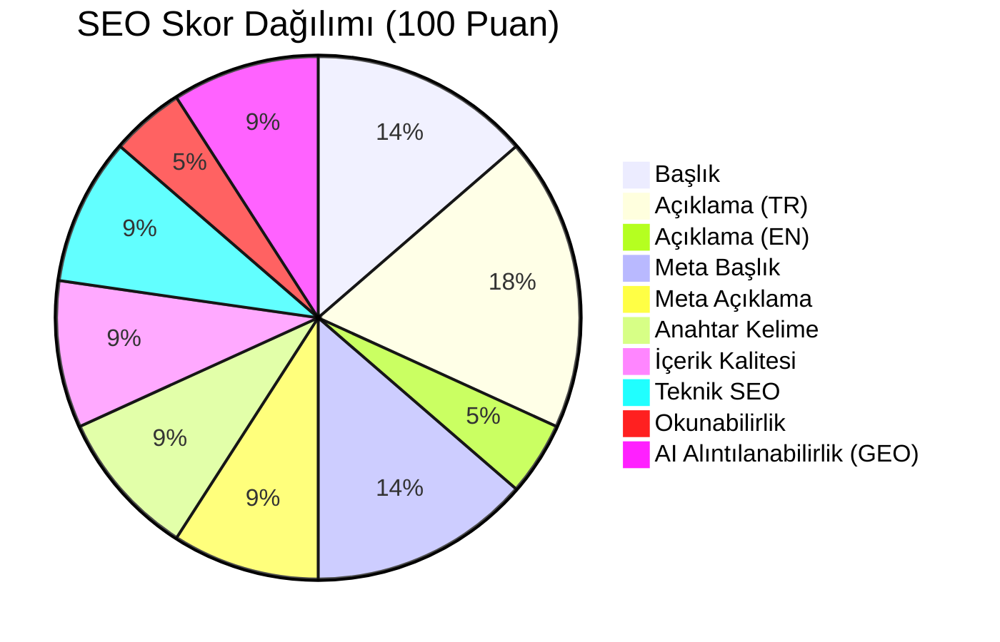

| Kategori | Puan | Kontrol ettikleri |
|---|---|---|
| Başlık | 15 | Uzunluk, büyük harf, güçlü kelimeler, özel karakterler |
| Açıklama (TR) | 20 | Kelime sayısı, paragraf yapısı, HTML öğeleri |
| Açıklama (EN) | 5 | Çeviri kalitesi, min kelime sayısı |
| Meta Başlık | 15 | 50-60 karakter, marka ayırıcı, benzersizlik |
| Meta Açıklama | 10 | 120-160 karakter, CTA varlığı |
| Anahtar Kelime | 10 | Kelime yerleşimi, kategori uyumu, tutarlılık |
| İçerik Kalitesi | 10 | Stuffing tespiti, kelime çeşitliliği, tutarlılık |
| Teknik SEO | 10 | Görseller, etiketler, kategoriler, slug, fiyat |
| Okunabilirlik | 5 | Cümle uzunluğu, varyasyon, geçiş kelimeleri |
| **AI Alıntılanabilirlik (GEO)** | **10** | Yapılandırılmış bilgiler, net özellikler, AI okunabilir format |

Son kategori — **AI Alıntılanabilirlik** — bu projeyi geleceğe taşıyan şey. İçeriğinizin AI arama motorları tarafından ne kadar iyi alıntılanabileceğini skorluyor.

### GEO Site Denetimi

**Herhangi bir web sitesini** Generative Engine Optimization hazırlığı için denetleyen bağımsız tarayıcı:

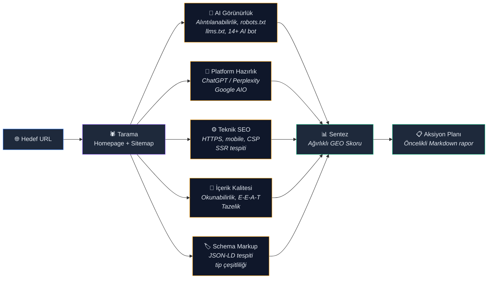

5 analiz ajanı `asyncio.gather` ile **paralel** çalışır. Sentez ağırlıkları:

| Kategori | Ağırlık |
|---|---|
| AI Alıntılanabilirlik / Görünürlük | %25 |
| Marka Otorite Sinyalleri | %20 |
| İçerik Kalitesi (E-E-A-T) | %20 |
| Teknik Altyapı | %15 |
| Yapılandırılmış Veri | %10 |
| Platform Optimizasyonu | %10 |

### llms.txt Studio

AI arama motorları ve asistanlar için daha okunabilir içerik blokları üretmek üzere `llms.txt` akışı ayrı bir stüdyo ekranında yönetilir. Sistem yeni veya güncellenen ürünleri kuyruklar, özetleri batch halinde üretir ve indirilebilir bir `llms.txt` çıktısına dönüştürür.

<p align="center">
  
</p>

<p align="center"><i>Özet kuyrukları, son üretilen bloklar ve indirilebilir `llms.txt` çıktısı tek ekranda yönetilir</i></p>

### Semantik Yönlendirmeli Multi-Agent Chat

Chat paneli tek bir chatbot değil — **üç uzman ajan** ve otomatik yönlendirme:

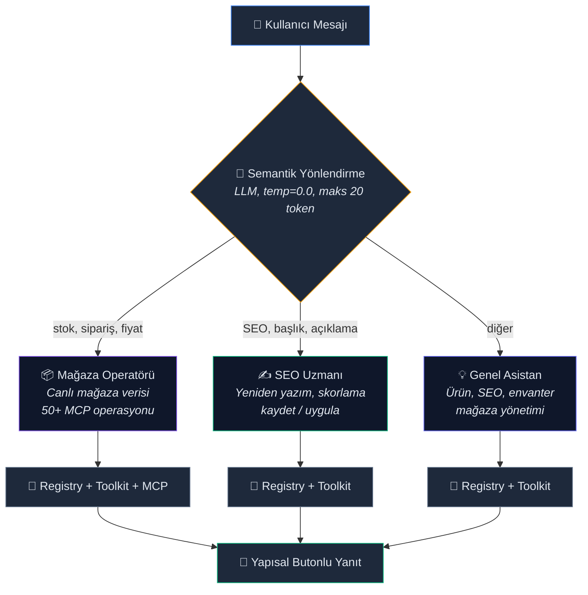

Her kullanıcı mesajı LLM tarafından semantik olarak sınıflandırılır — etiket veya komut gerekmez. Stok sorguladığınızda Operatör'e, başlık optimize etmek istediğinizde SEO Uzmanı'na yönlendirilirsiniz.

<p align="center">
  <video src="./assets/ikasseo1.mp4" controls muted playsinline width="1100"></video>
</p>

<p align="center"><i>Chat kullanım videosu README önizlemesinde gömülü görünmezse <a href="./assets/ikasseo1.mp4">buradan açabilirsiniz</a></i></p>

### Uygulama Sonrası Doğrulama ve Skor Karşılaştırması

Değişiklikler ikas'a uygulandıktan sonra sistem otomatik olarak:
1. Ürünü ikas'tan tekrar çeker (güncel veriyi doğrular)
2. Lokal ürün verisini ve veritabanını günceller
3. SEO analizini yeniden çalıştırır
4. Eski/yeni skor farkını alan bazlı gösterir (ör: 📈 65/100 → 74/100, +9 puan)

<p align="center">
  
</p>

<p align="center"><i>İnceleme masasında alan bazlı farklar görülür, öneriler tek tek veya toplu olarak onaylanabilir</i></p>

### Yapısal Seçenek Butonları

AI önerileri chat'te **tıklanabilir butonlar** olarak gösterilir — kullanıcının serbest metin yazıp cevap vermesi gerekmez. Typo, belirsizlik ve niyet ayrıştırma ihtiyacını ortadan kaldırır.

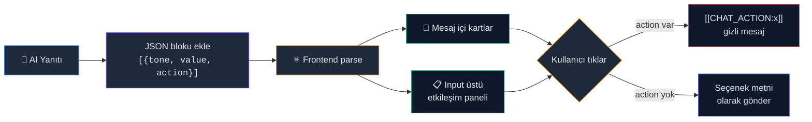

`action` anahtarı olan butonlar `[[CHAT_ACTION:action_name]]` gizli mesajı gönderir — serbest metin belirsizliği olmadan deterministik çok adımlı iş akışları (kaydet → incele → uygula) sağlar.

### Provider Agnostik

Tek kod tabanı, **8 AI sağlayıcı**:

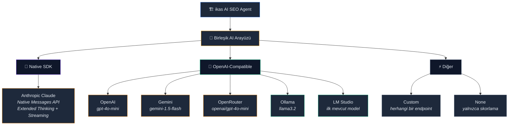

**Anthropic Claude**, native Messages API ile tam entegre: extended thinking (derin akıl yürütme), streaming yanıtlar, istek iptali ve model bazlı maliyet takibi. Diğer sağlayıcılar birleşik OpenAI-compatible arayüz üzerinden tool calling destekler. Bir ortam değişkeni değiştirin — tüm agentic pipeline, chat sistemi ve streaming aynı şekilde çalışır.

### Ürün Başına Chat Geçmişi

Her ürünün sohbet geçmişi tarayıcının `localStorage` alanına ayrı ayrı kaydedilir. Farklı bir ürüne geçip geri döndüğünüzde konuşmadan kaldığınız yerden devam edersiniz. Sayfa yenilemelerinde geçmiş korunur; son 50 mesaj saklanır.

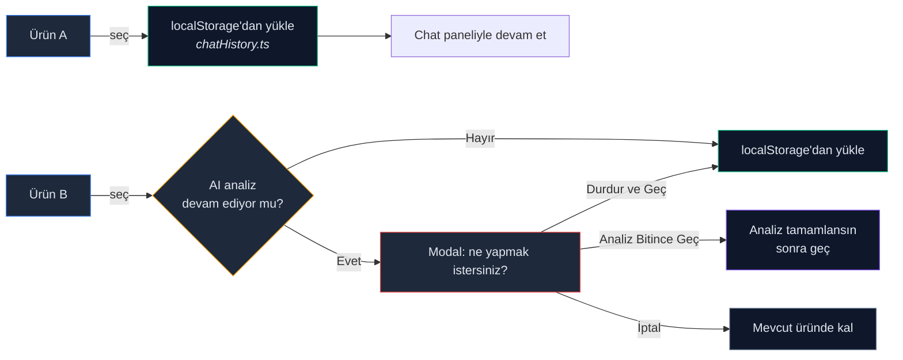

Bir AI analizi devam ederken başka bir ürüne tıklanırsa **ürün-geçiş koruma modali** açılır: analizi durdurup geç, bitmesini bekle veya iptal et seçenekleri sunulur.

### Toplu SEO Optimizasyonu

Yüzlerce ürünü tek tıklamayla optimize eden **5 aşamalı batch iş akışı**:

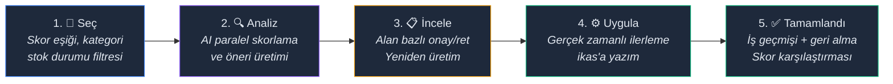

- **Threshold tabanlı filtreleme** — skor eşiği, kategori ve stok durumuna göre ürün seçimi
- **Toplu onay/ret** — tüm önerileri tek seferde ya da alan bazında onaylayın
- **Alan bazlı yeniden üretim** — beğenmediğiniz tek bir alanı yeniden oluşturun
- **Tam geri alma desteği** — tekil ürün veya tüm batch geri alınabilir

### llms.txt Studio

**Tüm ürün kataloğunu** `ChatGPT`, `Perplexity` ve `Claude` gibi AI motorlarının alıntılayabileceği ansiklopedik özetlere dönüştüren, yönetilen iş kuyruğu. Çıktı, standart `llms.txt` formatında export edilir.

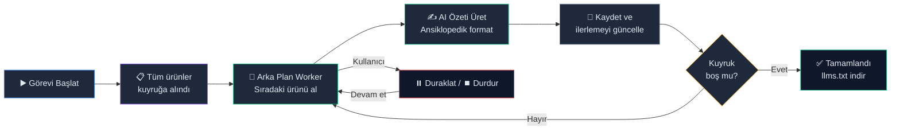

- **Yönetilen iş kuyruğu** — Start / Pause / Resume / Stop kontrolleriyle çalışan async arka plan worker
- **Gerçek zamanlı sayaçlar** — toplam / işlendi / bekliyor / başarısız canlı takibi; tıklanabilir stat kartları listeyi filtreler
- **Tekil yeniden üretim** — beğenmediğiniz tek bir ürün özetini anında yeniden oluşturma
- **Kesintiden devam** — backend yeniden başlatılsa bile yarıda kalan iş otomatik sürdürülür
- **Tek tıkla indirme** — tüm özetler standart `llms.txt` formatında dışa aktarılır

### Prompts Studio

Sistemdeki **tüm AI prompt şablonlarını** düzenleyip yönetebileceğiniz tam özellikli editör. Hiçbir Python dosyasına dokunmadan, Settings sayfasından canlı olarak her prompt'u güncelleyebilirsiniz.

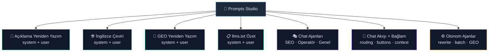

- **7 grup, 20+ şablon** — ürün yeniden yazımı, çeviri, GEO, llms.txt özeti, chat ajanı personaları, akış bağlamı ve otonom ajan prompt'ları
- **`{{değişken}}` doğrulama** — tanımsız placeholder kullanımında kayıt öncesi uyarı; her prompt için kullanılabilir değişkenler listelidir
- **Değişiklik takibi** — kaydedilmemiş prompt'lar görsel olarak işaretlenir; tek seferde toplu kayıt
- **Varsayılana sıfırlama** — tekil prompt veya tüm grubu tek tıkla kod içi varsayılana döndürme
- **Anlık arama** — tüm prompt başlık ve içeriklerinde canlı filtreleme
- **Prompt katman görselleştirmesi** — hangi prompt'un hangi pipeline'da nasıl birleştiğini gösteren diyagram; akışı anlamak için Settings sayfasında "Katmanlama" sekmesi

### SEO/GEO Raporlama

Skor geçmişini izleyen ve iyileşmeleri görselleştiren **analitik dashboard**:

- **Trend grafikleri** — 7/30/90/365 günlük dönemlerde mağaza geneli skor eğrisi
- **Alt-skor karşılaştırması** — ilk ve son anlık görüntü arasında 10+ boyutta bar grafiği (başlık, açıklama, meta alanlar, içerik kalitesi, okunabilirlik vb.)
- **En çok gelişenler** — skor artışına göre sıralı ürün listesi
- **Ürün bazlı drilldown** — her ürünün kendi trend grafiği
- **Sorun trendi** — zaman içinde ortalama sorun sayısı takibi
- **Anlık görüntü** — karşılaştırma için mevcut durumu elle kaydedin

### Varsayılan Olarak Güvenli

`DRY_RUN=true` varsayılandır. Siz açıkça izin vermeden ikas mağazanıza hiçbir şey yazılmaz. Her öneri, uygulanmadan önce bir insan onay adımından geçer.

---

## Mimari

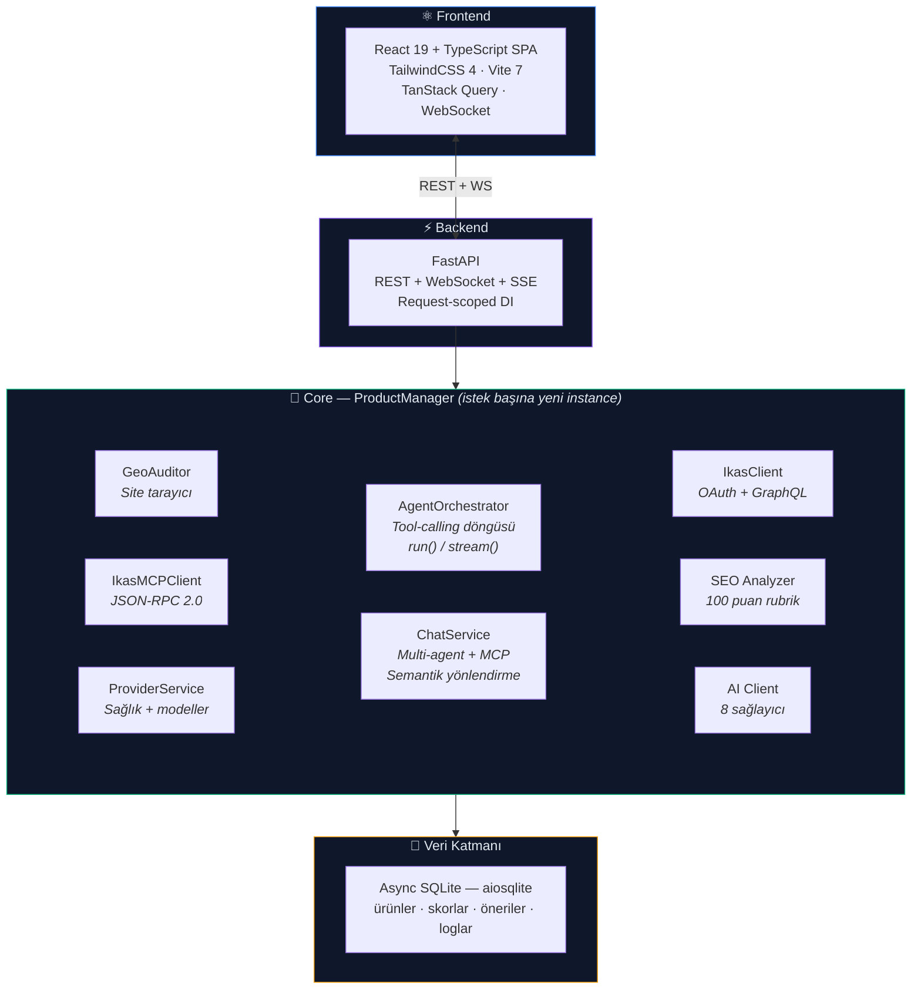

### Dikkat Çeken Tasarım Kararları

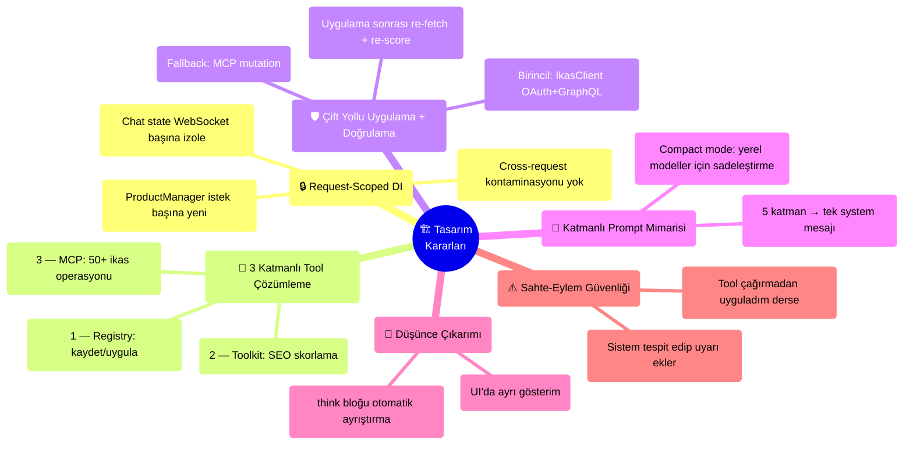

---

## Chat Mesaj İşleme Akışı

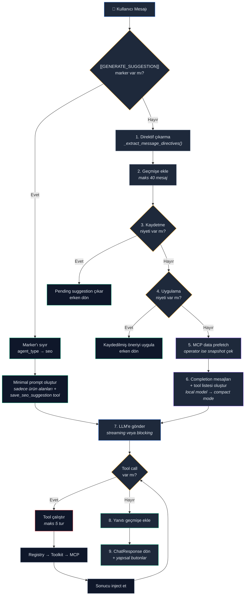

> **Compact Mode:** LM Studio ve Ollama gibi yerel modeller için sistem prompt'u otomatik olarak sadeleştirilir — verbose örnekler, operasyon rehberi ve routing talimatları kaldırılır. `[[GENERATE_SUGGESTION]]` isteklerinde ise yalnızca ürün alanları ve `save_seo_suggestion` tool'u gönderilir (~500 token vs ~10K).

---

## Tool Çözümleme Hiyerarşisi

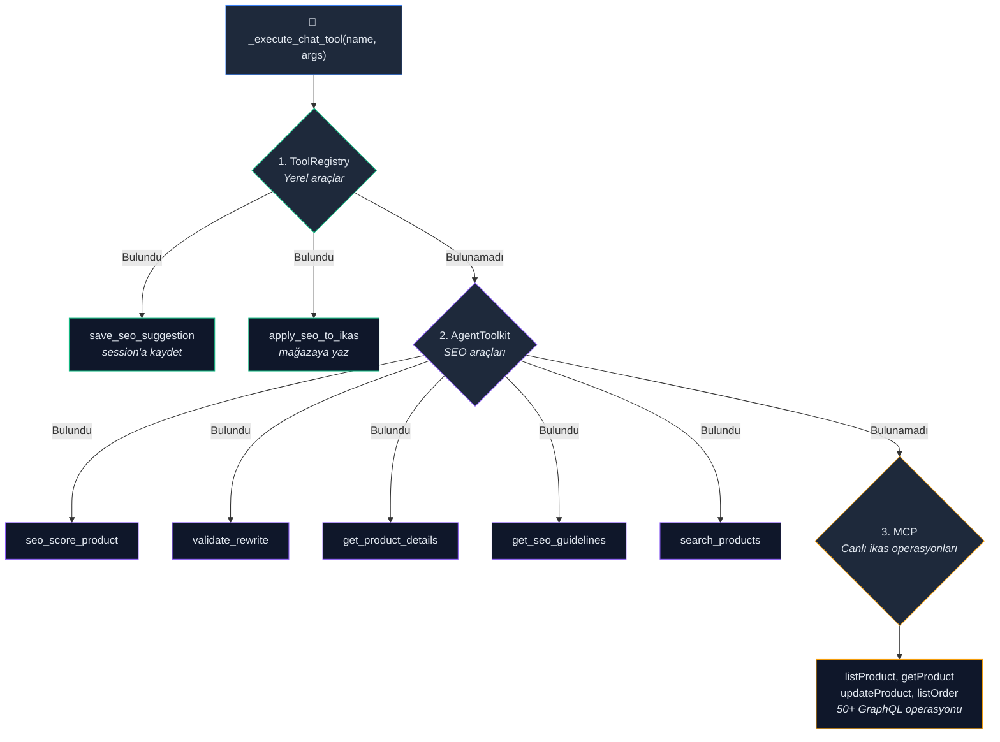

---

## Çift Yollu Uygulama Stratejisi

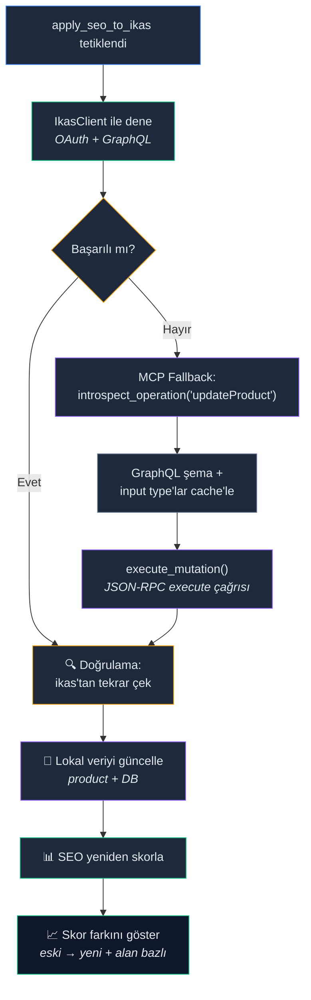

---

## Konfigürasyon Çözümleme

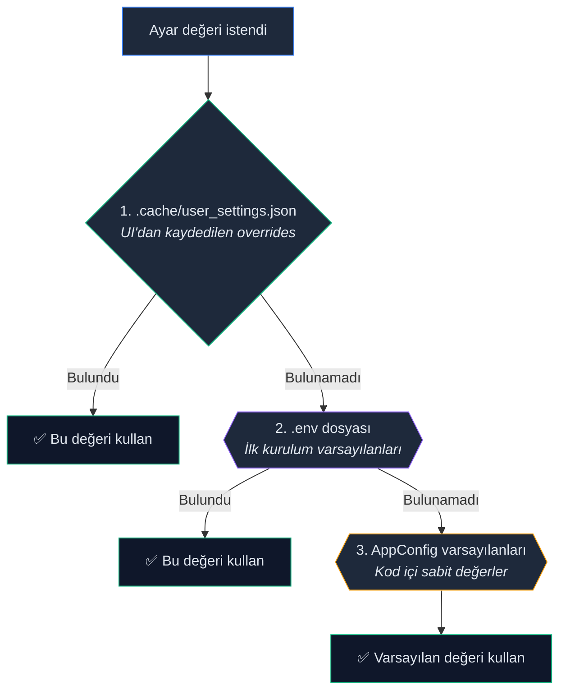

---

## Hızlı Başlangıç

### Gereksinimler
- Python 3.11+
- Node.js 20+

### Kurulum

```bash
git clone https://github.com/YigitKa/ikas-ai-seo-agent.git
cd ikas-ai-seo-agent

# Python
python -m venv .venv
source .venv/bin/activate    # Windows: .venv\Scripts\activate
pip install -r requirements.txt

# Frontend
cd web && npm install && cd ..

# Konfigürasyon
cp .env.example .env
# .env dosyasını ikas kimlik bilgileri ve AI provider anahtarıyla düzenleyin
```

### Çalıştırma

```bash
# Geliştirme (önerilen) — backend :8000 + Vite :5173
python main.py dev

# Production — frontend build eder, her şeyi :8000'den sunar
python main.py
```

### Doğrulama

```bash
python -m pytest tests/ -v
```

---

## Konfigürasyon

### Zorunlu

| Değişken | Açıklama |
|---|---|
| `IKAS_STORE_NAME` | ikas mağaza alt alan adı |
| `IKAS_CLIENT_ID` | ikas admin panelinden OAuth2 client ID |
| `IKAS_CLIENT_SECRET` | OAuth2 client secret |
| `AI_PROVIDER` | `anthropic`, `openai`, `gemini`, `openrouter`, `ollama`, `lm-studio`, `custom` veya `none` |
| `AI_API_KEY` | Bulut sağlayıcılar için API anahtarı |

### Opsiyonel

| Değişken | Varsayılan | Açıklama |
|---|---|---|
| `AI_MODEL_NAME` | Provider varsayılanı | Model seçimini geçersiz kıl |
| `AI_TEMPERATURE` | `0.7` | Üretim yaratıcılığı |
| `AI_MAX_TOKENS` | `2000` | Maks çıktı token |
| `AI_THINKING_MODE_CHAT` | `false` | Native extended thinking for chat (Anthropic Claude — `temperature=1` zorunlu, budget otomatik ayarlanır) |
| `AI_THINKING_MODE_BATCH` | `false` | Native extended thinking for batch/agentic rewrites (Anthropic Claude — `temperature=1` zorunlu, budget otomatik ayarlanır) |
| `IKAS_MCP_TOKEN` | — | Chat'te canlı mağaza sorgularını etkinleştirir |
| `STORE_LANGUAGES` | `tr,en` | Desteklenen içerik dilleri |
| `SEO_TARGET_KEYWORDS` | — | Virgülle ayrılmış hedef anahtar kelimeler |
| `SEO_LOW_SCORE_THRESHOLD` | `70` | Ürünlerin dikkat gerektirdiği skor eşiği |
| `DRY_RUN` | `true` | ikas'a yazmak için `false` yapın |

---

## Nasıl Çalışır

### Dashboard Akışı

```mermaid
graph LR
    SYNC["1. 🔄 Senkronize Et<br/><i>ikas'tan ürünleri çek</i>"] --> BROWSE["2. 📋 Listele<br/><i>Skor rozetleri ile</i>"]
    BROWSE --> SELECT["3. 🎯 Seç<br/><i>Skor kırılımı + chat</i>"]
    SELECT --> HIST["3b. 📂 Geçmiş Yükle<br/><i>localStorage — ürün başına</i>"]
    HIST --> CHAT["4. 💬 Chat / AI Öner<br/><i>Otonom yeniden yazım</i>"]
    CHAT --> REVIEW["5. 🔍 İncele<br/><i>Önce/sonra diff</i>"]
    REVIEW --> APPLY["6. ✅ Onayla<br/><i>ikas'a uygula</i>"]
    APPLY --> VERIFY["7. 📊 Doğrula<br/><i>Skor karşılaştırması</i>"]

    style SYNC fill:#1e293b,stroke:#3b82f6,color:#e2e8f0
    style BROWSE fill:#1e293b,stroke:#8b5cf6,color:#e2e8f0
    style SELECT fill:#1e293b,stroke:#6366f1,color:#e2e8f0
    style HIST fill:#1e293b,stroke:#64748b,color:#e2e8f0
    style CHAT fill:#1e293b,stroke:#10b981,color:#e2e8f0
    style REVIEW fill:#1e293b,stroke:#f59e0b,color:#e2e8f0
    style APPLY fill:#1e293b,stroke:#10b981,color:#e2e8f0
    style VERIFY fill:#1e293b,stroke:#3b82f6,color:#e2e8f0
```

<p align="center">
  
</p>

<p align="center"><i>Ürün listesi, SEO/GEO/AEO skorları ve çalışan ajan durumu aynı dashboard üzerinde izlenir</i></p>

### Katmanlı Prompt Mimarisi

Tüm katmanlar **tek bir `system` mesajında** birleştirilir (qwen, llama gibi modellerin jinja template'leri birden fazla system mesajını desteklemez).

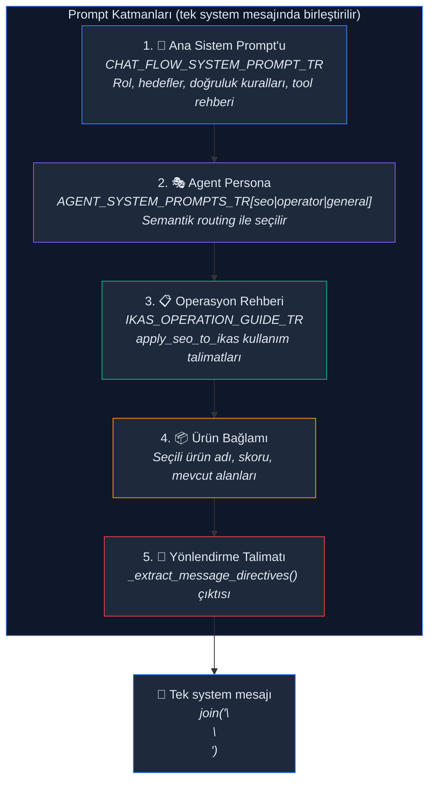

> **Compact Mode (Yerel Modeller):** LM Studio ve Ollama kullanılırken 3. katman (Operasyon Rehberi), 5. katman (Yönlendirme Talimatı) ve verbose tool talimatları otomatik olarak atlanır. Bunların yerine kısa bir JSON buton formatı talimatı eklenir. Bu sayede ~10K token'lık tam prompt yerine ~2-3K token'lık minimal prompt gönderilir.

<p align="center">
  
</p>

<p align="center"><i>Prompt Studio ile sistem ve kullanıcı prompt'ları tek yerden düzenlenip katmanlı yapı korunur</i></p>

---

## Teknoloji Yığını

### Backend
- **Python 3.11+** — async-first, `asyncio`
- **FastAPI** — REST API + WebSocket
- **aiosqlite** — async SQLite
- **httpx** — async HTTP (ikas GraphQL + MCP)
- **Pydantic v2** — veri doğrulama ve serileştirme

### Frontend
- **React 19** + **TypeScript 5.9**
- **Vite 7** — dev server + production build
- **TailwindCSS 4** — utility-first stil
- **TanStack Query 5** — sunucu durum yönetimi
- **React Router 7** — istemci tarafı routing
- **react-markdown** — chat mesaj renderlama

### Protokoller
- **OAuth2** — ikas API kimlik doğrulama
- **GraphQL** — ikas ürün CRUD
- **JSON-RPC 2.0** — ikas MCP (Model Context Protocol)
- **OpenAI-compatible** — birleşik AI sağlayıcı arayüzü
- **SSE** — gerçek zamanlı agent progress streaming
- **WebSocket** — çift yönlü chat

---

## Proje Yapısı

```
ikas-ai-seo-agent/
├── main.py                     # Giriş noktası
├── start.py                    # Backend/frontend koordinatörü
│
├── config/settings.py          # 3 katmanlı konfigürasyon çözümleme
│
├── core/                       # İş mantığı — UI bağımlılığı yok
│   ├── models.py               # Pydantic modeller (Product, SeoScore, AgentEvent, vb.)
│   ├── product_manager.py      # Merkezi orkestratör
│   ├── prompt_store.py         # Template yükleme + multi-agent prompt'lar
│   │
│   ├── ai/client.py            # Multi-provider AI soyutlaması (fabrika + adaptörler)
│   ├── agent/orchestrator.py   # Jenerik agent döngüsü (run + stream)
│   ├── agent/tools.py          # Tool tanımları + toolkit fabrikaları
│   │
│   ├── chat/                   # Çok turlu chat (mixin composition)
│   │   ├── state.py            # Konuşma geçmişi + ürün bağlamı
│   │   ├── streaming.py        # SSE streaming + multi-agent routing
│   │   ├── suggestions.py      # Taslak → inceleme → uygulama akışları
│   │   ├── support.py          # ToolRegistry + yardımcılar
│   │   └── guidance.py         # Operasyon önerileri + sahte-eylem güvenliği
│   │
│   ├── seo/analyzer.py         # 100 puanlık skorlama motoru
│   ├── seo/geo_audit.py        # Tam site GEO denetim pipeline'ı
│   │
│   ├── clients/ikas.py         # Async GraphQL istemcisi (OAuth2)
│   ├── clients/mcp.py          # ikas MCP JSON-RPC istemcisi
│   │
│   ├── services/provider.py    # Sağlayıcı sağlık + model keşfi
│   ├── services/settings.py    # Ayar yönetimi
│   └── services/suggestion.py  # Öneri alan operasyonları
│
├── api/                        # FastAPI REST + WebSocket
│   ├── main.py                 # Uygulama kurulumu, CORS, SPA sunumu
│   ├── dependencies.py         # Request-scoped DI
│   └── routers/                # products, seo, suggestions, settings, chat
│
├── web/src/                    # React/TypeScript SPA
│   ├── pages/                  # Dashboard, Settings, LlmsLab, BatchOperations, Reports
│   ├── components/             # ChatPanel, ProductTable, ScoreCard (Quick Wins)
│   │   ├── chat/messages/      # MessageBubble, ToolResultCard (SEO agent + MCP), ThinkingBlock, CostCard
│   │   └── dashboard/          # DashboardHeader (sync butonu), DashboardSidebar (boş arama durumu)
│   ├── shared/
│   │   ├── score/scoreUtils.ts # SCORE_FIELDS, getScoreColor, explainIssue
│   │   └── ui/                 # Toast (bildirim sistemi), ConfirmDialog
│   ├── api/client.ts           # API istemci fonksiyonları
│   └── hooks/
│       ├── useChat.ts          # Chat durum yönetimi
│       └── chat/chatHistory.ts # localStorage chat geçmişi (ürün başına, son 50 mesaj)
│
├── data/
│   ├── db.py                   # Async SQLite şema + yardımcılar
│   └── cache.py                # Dosya tabanlı TTL cache
│
├── prompts/                    # Düzenlenebilir AI prompt şablonları
└── tests/                      # 20+ test dosyası, canlı API çağrısı yok
```

---

## API Yüzeyi

### Ürünler
| Metod | Endpoint | Açıklama |
|---|---|---|
| `GET` | `/api/products` | Cache'deki ürünleri listele (filtrelenebilir) |
| `POST` | `/api/products/fetch` | ikas'tan çek |
| `POST` | `/api/products/sync` | Tam katalog senkronizasyonu |
| `GET` | `/api/products/{id}` | Tekil ürün detayı |

### SEO
| Metod | Endpoint | Açıklama |
|---|---|---|
| `POST` | `/api/seo/analyze` | Tüm ürünleri skorla |
| `POST` | `/api/seo/analyze/{id}` | Tekil ürün skorla |
| `GET` | `/api/seo/generate-llms-txt` | AI tarayıcılar için `llms.txt` üret ve indir |
| `POST` | `/api/seo/geo-audit` | Tam GEO site denetimi |

### llms.txt Studio
| Metod | Endpoint | Açıklama |
|---|---|---|
| `GET` | `/api/llms/status` | İş durumu, sayaçlar, aktif ürün, son özetler |
| `POST` | `/api/llms/start` | Yeni özetleme işi oluştur ve başlat |
| `POST` | `/api/llms/pause` | Aktif işi duraklat (kuyruk konumu korunur) |
| `POST` | `/api/llms/resume` | Duraklatılmış işi kaldığı yerden sürdür |
| `POST` | `/api/llms/stop` | İşi tamamen durdur |
| `GET` | `/api/llms/processed` | İşlenmiş özetleri listele (sayfalandırılmış) |
| `GET` | `/api/llms/pending` | İşlenmemiş ürünleri listele |
| `POST` | `/api/llms/regenerate/{productId}` | Tek ürün özetini yeniden üret |

### Öneriler
| Metod | Endpoint | Açıklama |
|---|---|---|
| `POST` | `/api/suggestions/generate/{id}` | AI önerisi oluştur (agentic) |
| `POST` | `/api/suggestions/generate/{id}/stream` | SSE streaming ile oluştur |
| `PATCH` | `/api/suggestions/{id}/approve` | Öneriyi onayla |
| `POST` | `/api/suggestions/apply` | Onaylananları ikas'a uygula |

### Toplu İşlemler
| Metod | Endpoint | Açıklama |
|---|---|---|
| `GET` | `/api/batch/stats` | Batch dashboard istatistikleri |
| `GET` | `/api/batch/jobs` | Tüm batch işleri listele |
| `POST` | `/api/batch/jobs` | Yeni batch iş oluştur ve analizi başlat |
| `GET` | `/api/batch/jobs/{id}` | Batch iş detayı (öğelerle birlikte) |
| `GET` | `/api/batch/jobs/{id}/stream` | SSE ile gerçek zamanlı ilerleme |
| `POST` | `/api/batch/jobs/{id}/apply` | Onaylı önerileri ikas'a uygula |
| `POST` | `/api/batch/jobs/{id}/stop` | Çalışan işi durdur |
| `DELETE` | `/api/batch/jobs/{id}` | Batch işi sil |
| `POST` | `/api/batch/jobs/{id}/rollback` | Tüm batch'i geri al |
| `POST` | `/api/batch/items/{id}/rollback` | Tekil öğeyi geri al |
| `POST` | `/api/batch/items/{id}/regenerate` | Öğeyi yeniden üret |
| `POST` | `/api/batch/items/{id}/fields/{field}/regenerate` | Tek alanı yeniden üret |
| `PATCH` | `/api/batch/items/{id}` | Öğeyi onayla / reddet |
| `POST` | `/api/batch/items/bulk-decision` | Toplu onayla / reddet |

### Raporlar
| Metod | Endpoint | Açıklama |
|---|---|---|
| `GET` | `/api/reports/store-trends` | Mağaza geneli günlük skor ortalamaları |
| `GET` | `/api/reports/product-trends/{id}` | Ürün bazlı skor geçmişi |
| `GET` | `/api/reports/summary` | İlk / son anlık görüntü karşılaştırması |
| `GET` | `/api/reports/top-improvers` | En çok gelişen ürünler |
| `GET` | `/api/reports/snapshot-dates` | Tüm anlık görüntü tarihleri |
| `GET` | `/api/reports/snapshot/{date}` | Belirli bir tarihin tüm skor verileri |
| `POST` | `/api/reports/take-snapshot` | Anlık görüntü al (idempotent) |

### Gerçek Zamanlı
| Protokol | Endpoint | Açıklama |
|---|---|---|
| WebSocket | `/ws/chat` | Multi-agent AI chat |
| WebSocket | `/ws/progress` | Operasyon ilerleme durumu |

### Ayarlar & Prompts
| Metod | Endpoint | Açıklama |
|---|---|---|
| `GET` | `/api/settings` | Mevcut konfigürasyonu getir |
| `PUT` | `/api/settings` | Ayarları kaydet (`.cache/user_settings.json`'a yazar) |
| `GET` | `/api/settings/prompts` | Tüm prompt şablonlarını grup metadata'sıyla getir |
| `PUT` | `/api/settings/prompts` | Prompt şablonlarını kaydet (diske yazar) |
| `POST` | `/api/settings/prompts/reset` | Seçili veya tüm prompt'ları hardcoded varsayılana sıfırla |
| `GET` | `/api/settings/providers` | AI sağlayıcılarını etiket + model bilgisiyle listele |
| `GET` | `/api/settings/health` | Seçili sağlayıcı sağlık kontrolü |
| `GET` | `/api/settings/models/{provider}` | Sağlayıcıya ait kullanılabilir modelleri getir |
| `POST` | `/api/settings/test-connection` | Sağlayıcı bağlantısını test et |

### MCP
| Metod | Endpoint | Açıklama |
|---|---|---|
| `GET` | `/api/mcp/status` | MCP bağlantı durumu |
| `POST` | `/api/mcp/initialize` | MCP oturumu başlat |
| `POST` | `/api/chat/clear` | Sohbet geçmişini temizle |

---

## Katkıda Bulunma

```bash
# Tüm testler
python -m pytest tests/ -v

# Belirli bir test
python -m pytest tests/test_seo_analyzer.py -v
```

Testler mock ve fixture kullanır — canlı API çağrısı yapılmaz. Örnek ürünler: `tests/fixtures/sample_products.json`.

---

## Anthropic Claude Entegrasyonu

Bu proje **Anthropic Claude** ile en iyi deneyim icin optimize edilmistir. `AI_PROVIDER=anthropic` sectigenizde:

### Native Messages API
Diger saglayicilar OpenAI-compatible endpoint kullanirken, Claude **native Anthropic SDK** (`anthropic` Python paketi) ile entegre olur. Bu sayede:
- **Extended Thinking**: `AI_THINKING_MODE=true` ile Claude'un derin akil yurutme yetenegi aktive olur. Otomatik olarak `temperature=1` ayarlanir ve thinking budget hesaplanir
- **Streaming**: Gercek zamanli yanitlar — hem dusunme bloklari hem metin parcalari anlik iletilir
- **Istek Iptali**: Uzun suren istekler `cancel_active_request()` ile aninda iptal edilebilir
- **Token Takibi**: Her API cagrisi icin input/output token sayimi ve model bazli maliyet tahmini

### Desteklenen Modeller
| Model | Kullanim | Maliyet (1M token) |
|---|---|---|
| `claude-haiku-4-5-20251001` | Varsayilan — hizli ve ekonomik | $0.80 input / $4.0 output |
| `claude-sonnet-4-20250514` | Dengeli performans | $3.0 input / $15.0 output |
| `claude-opus-4-20250514` | Maksimum kalite | $15.0 input / $75.0 output |

### Hizli Baslangic
```bash
# .env dosyaniza ekleyin:
AI_PROVIDER=anthropic
AI_API_KEY=sk-ant-api03-...  # Anthropic Console'dan alin
AI_MODEL_NAME=claude-haiku-4-5-20251001  # Opsiyonel, varsayilan zaten bu
AI_THINKING_MODE_CHAT=false   # Chat icin derin dusunme, true yapin
AI_THINKING_MODE_BATCH=false  # Batch/agentic rewrite icin derin dusunme, true yapin
```

### Agentic Pipeline ile Claude
Claude'un tool calling yetenegi sayesinde **otonom SEO optimizasyonu** calisir:
1. `seo_score_product` — urunu skorlar
2. `validate_rewrite` — yeniden yazimlari dogrular
3. `save_suggestion` — oneriyi kaydeder
4. Maks 8 iterasyon ile iyilestirme dongusu

Chat modunda uc uzman ajan (SEO Uzmani, Magaza Operatoru, Genel Asistan) Claude uzerinden calisir ve semantik yonlendirme ile otomatik secilir.

---

## Lisans

MIT
