# ikas AI SEO Agent

**E-ticaret ürün içeriklerini otonom olarak analiz eden, skorlayan ve yeniden yazan AI ajan sistemi — maksimum SEO ve AI keşfedilebilirliği için.**

[ikas](https://ikas.com) mağazaları için geliştirildi. GraphQL API üzerinden bağlanır, her ürünü 100 puanlık bir rubrikle skorlar, ardından otonom bir AI pipeline ile zayıf alanları tespit eder, iteratif olarak yeniden yazar, iyileşmeleri doğrular ve önerileri kaydeder — ürün başına insan müdahalesi gerekmeden.

Full-stack web uygulaması: **React/TypeScript** frontend, **FastAPI** backend, **async SQLite** depolama.

<p align="center">
  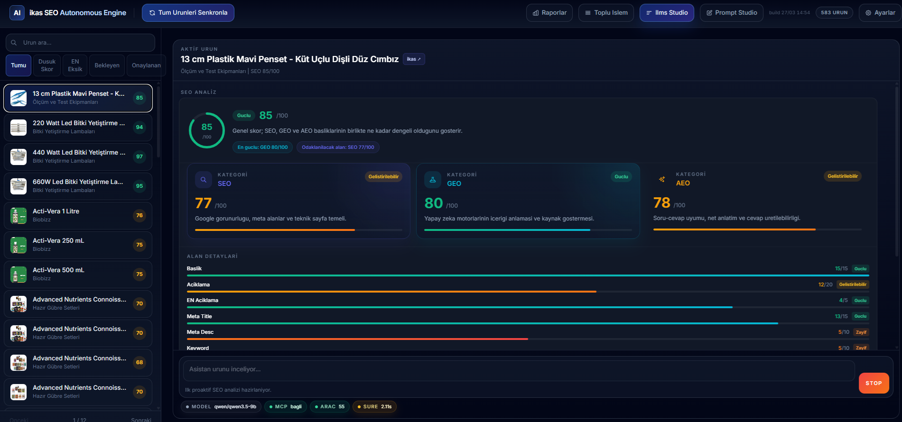
</p>

<p align="center"><i>Dashboard: ürün listesi, SEO/GEO/AEO skorları ve çalışan ajan durumu tek ekranda</i></p>

---

## Problem → Çözüm

E-ticarette SEO optimizasyonu tekrarlayan, pahalı ve giderek yetersiz kalıyor. Her ürün için iyi bir başlık, zengin açıklama, doğru meta etiketleri, çok dilli içerik ve — AI arama çağında — ChatGPT, Perplexity ve Google AI Overviews'un alıntılayabileceği yapılandırılmış bilgiler gerekiyor. Bunu yüzlerce ürün için manuel yapmak pratik değil; tek bir AI prompt'u ile yapmak ise kalite kontrolsüz, sıradan sonuçlar üretiyor.

Bu ajan sadece içerik üretmiyor — **düşünüyor, skorluyor, yeniden yazıyor, doğruluyor ve iterasyon yapıyor**:


```mermaid
graph TD
    A["🔍 Ürünü skorla<br/><i>100 puanlık rubrik</i>"] --> B["📊 En zayıf alanları tespit et"]
    B --> C["✍️ Alanı SEO best practice'lere göre yeniden yaz"]
    C --> D{"✅ Skor iyileşti mi?"}
    D -->|Evet| E{"Başka zayıf alan var mı?"}
    D -->|Hayır| F["🔄 Farklı strateji dene<br/><i>alan başına maks 2 deneme</i>"]
    F --> D
    E -->|Evet| C
    E -->|Hayır| G["💾 Öneriyi kaydet"]

    style A fill:#1e293b,stroke:#3b82f6,color:#e2e8f0
    style B fill:#1e293b,stroke:#8b5cf6,color:#e2e8f0
    style C fill:#1e293b,stroke:#10b981,color:#e2e8f0
    style D fill:#1e293b,stroke:#f59e0b,color:#e2e8f0
    style E fill:#1e293b,stroke:#f59e0b,color:#e2e8f0
    style F fill:#1e293b,stroke:#ef4444,color:#e2e8f0
    style G fill:#1e293b,stroke:#10b981,color:#e2e8f0
```

<p align="center"><i>Maks 8 otonom iterasyon — her yeniden yazım kabul edilmeden önce doğrulanır</i></p>

Sonuç: ölçülebilir, doğrulanmış SEO iyileştirmeleri — "AI üretimi metin" değil.

---

## Hızlı Başlangıç

### Gereksinimler

- Python 3.11+
- Node.js 20+

### Kurulum

```bash
git clone https://github.com/YigitKa/ikas-ai-seo-agent.git
cd ikas-ai-seo-agent

# Python
python -m venv .venv
source .venv/bin/activate    # Windows: .venv\Scripts\activate
pip install -r requirements.txt

# Frontend
cd web && npm install && cd ..

# Konfigürasyon
cp .env.example .env
# .env dosyasını ikas kimlik bilgileri ve AI provider anahtarıyla düzenleyin
```

### Çalıştırma

```bash
# Geliştirme (önerilen) — backend :8000 + Vite :5173
python main.py dev

# Production — frontend build eder, her şeyi :8000'den sunar
python main.py
```

### Doğrulama

```bash
python -m pytest tests/ -v
```

---

## Yetenekler

### 🤖 Otonom SEO Optimizasyonu

AI tek seferlik istek/cevap yapmıyor. **Tool calling** ile otonom bir döngü çalıştırıyor: skorla → yeniden yaz → doğrula → tekrarla. Her yeniden yazım kabul edilmeden önce rubriğe karşı kontrol ediliyor. İyileşme yoksa farklı bir yaklaşım deneniyor — alan başına 2, toplamda 8 iterasyona kadar.

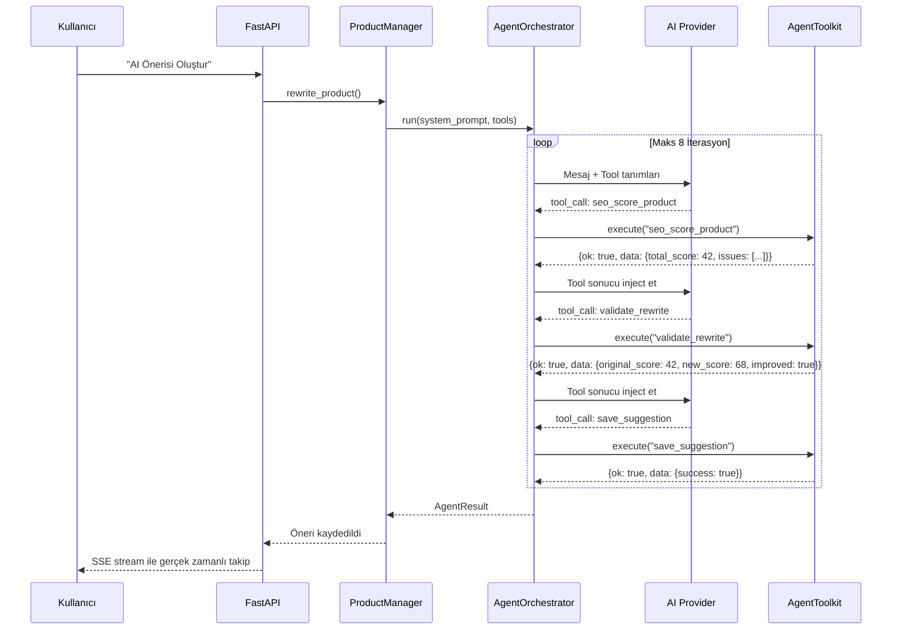
```mermaid
sequenceDiagram
    participant U as Kullanıcı
    participant API as FastAPI
    participant PM as ProductManager
    participant AO as AgentOrchestrator
    participant LLM as AI Provider
    participant T as AgentToolkit

    U->>API: "AI Önerisi Oluştur"
    API->>PM: rewrite_product()
    PM->>AO: run(system_prompt, tools)

    loop Maks 8 İterasyon
        AO->>LLM: Mesaj + Tool tanımları
        LLM-->>AO: tool_call: seo_score_product
        AO->>T: execute("seo_score_product")
        T-->>AO: {ok: true, data: {total_score: 42, issues: [...]}}
        AO->>LLM: Tool sonucu inject et

        LLM-->>AO: tool_call: validate_rewrite
        AO->>T: execute("validate_rewrite")
        T-->>AO: {ok: true, data: {original_score: 42, new_score: 68, improved: true}}
        AO->>LLM: Tool sonucu inject et

        LLM-->>AO: tool_call: save_suggestion
        AO->>T: execute("save_suggestion")
        T-->>AO: {ok: true, data: {success: true}}
    end

    AO-->>PM: AgentResult
    PM-->>API: Öneri kaydedildi
    API-->>U: SSE stream ile gerçek zamanlı takip
```

Değişiklikler ikas'a uygulandıktan sonra sistem otomatik olarak ürünü tekrar çeker, yeniden skorlar ve eski/yeni skor farkını alan bazlı gösterir (ör: 📈 65/100 → 74/100, +9 puan).

<p align="center">
  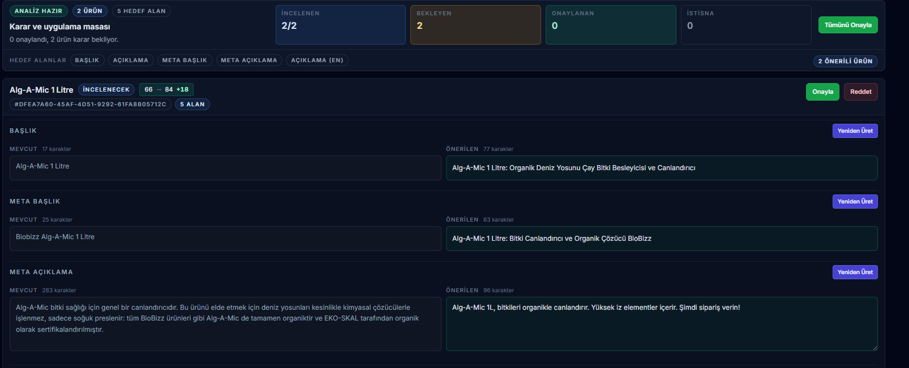
</p>

<p align="center"><i>İnceleme masasında alan bazlı farklar görülür, öneriler tek tek veya toplu olarak onaylanabilir</i></p>

---

### 📊 100 Puanlık SEO Skorlama Motoru

Ahrefs, Semrush, Yoast, Moz ve Screaming Frog'dan ilham alan kural tabanlı rubrik:

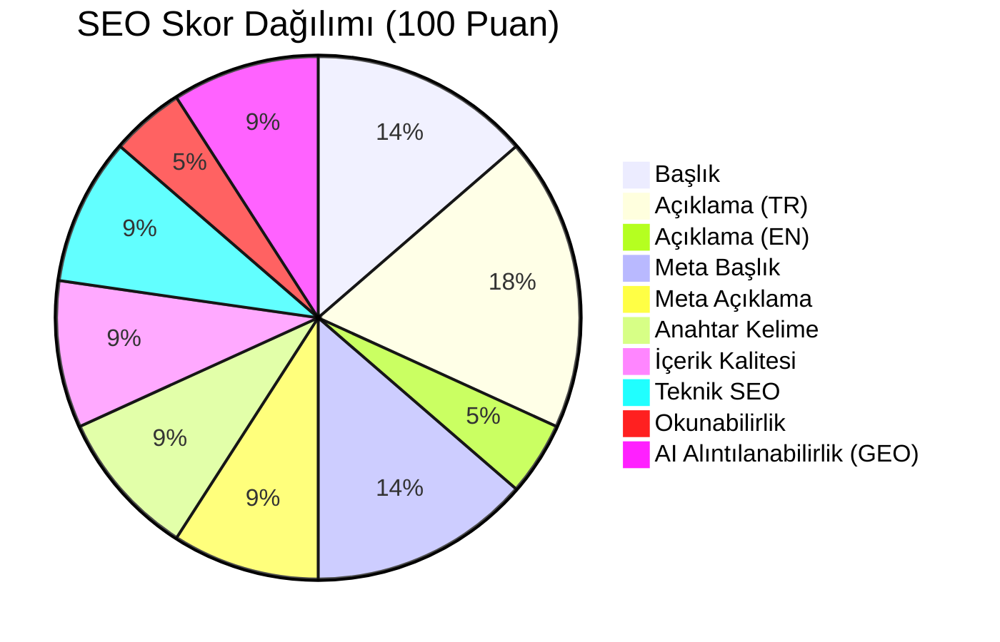
```mermaid
pie title SEO Skor Dağılımı (100 Puan)
    "Başlık" : 15
    "Açıklama (TR)" : 20
    "Açıklama (EN)" : 5
    "Meta Başlık" : 15
    "Meta Açıklama" : 10
    "Anahtar Kelime" : 10
    "İçerik Kalitesi" : 10
    "Teknik SEO" : 10
    "Okunabilirlik" : 5
    "AI Alıntılanabilirlik (GEO)" : 10
```

| Kategori | Puan | Kontrol ettikleri |
|---|---|---|
| Başlık | 15 | Uzunluk, büyük harf, güçlü kelimeler, özel karakterler |
| Açıklama (TR) | 20 | Kelime sayısı, paragraf yapısı, HTML öğeleri |
| Açıklama (EN) | 5 | Çeviri kalitesi, min kelime sayısı |
| Meta Başlık | 15 | 50-60 karakter, marka ayırıcı, benzersizlik |
| Meta Açıklama | 10 | 120-160 karakter, CTA varlığı |
| Anahtar Kelime | 10 | Kelime yerleşimi, kategori uyumu, tutarlılık |
| İçerik Kalitesi | 10 | Stuffing tespiti, kelime çeşitliliği, tutarlılık |
| Teknik SEO | 10 | Görseller, etiketler, kategoriler, slug, fiyat |
| Okunabilirlik | 5 | Cümle uzunluğu, varyasyon, geçiş kelimeleri |
| **AI Alıntılanabilirlik (GEO)** | **10** | Yapılandırılmış bilgiler, net özellikler, AI okunabilir format |

Son kategori — **AI Alıntılanabilirlik** — bu projeyi geleceğe taşıyan şey. İçeriğinizin AI arama motorları tarafından ne kadar iyi alıntılanabileceğini skorluyor.

---

### 💬 Multi-Agent Chat

Chat paneli tek bir chatbot değil — **üç uzman ajan** ve otomatik semantik yönlendirme:

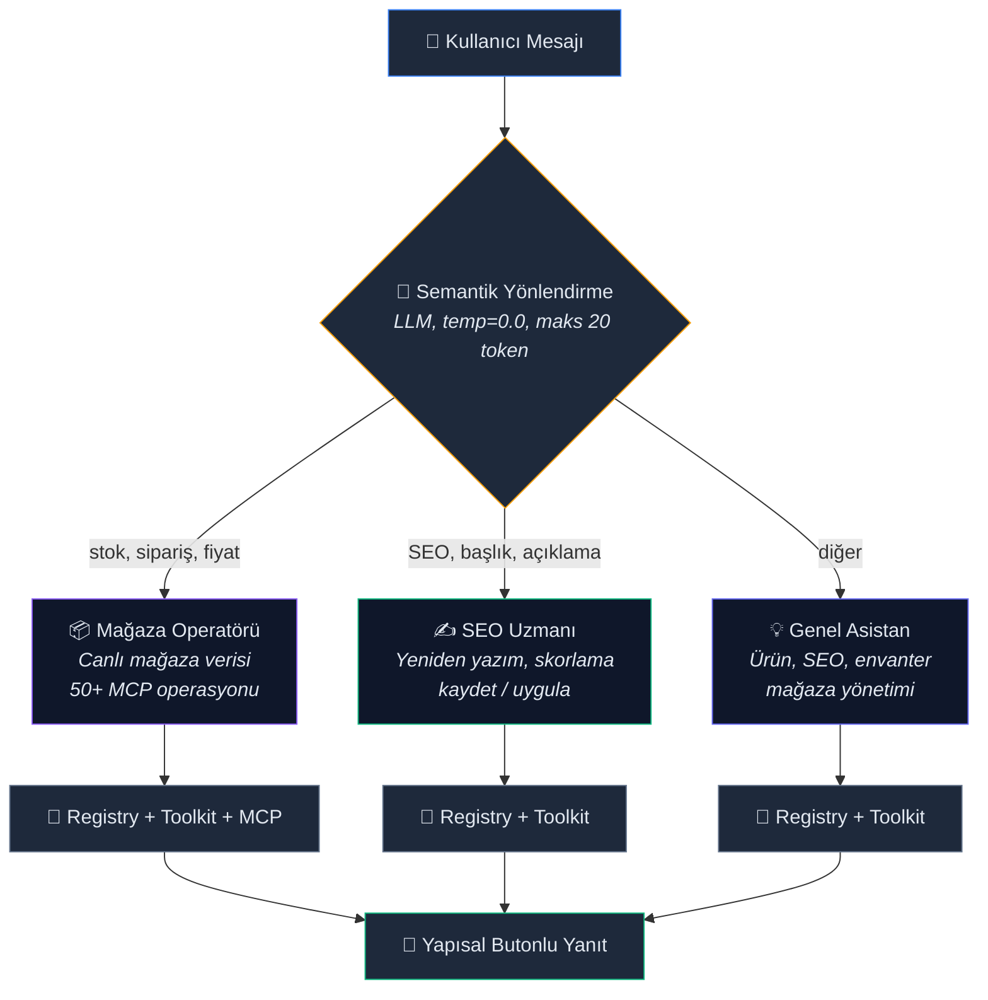
```mermaid
graph TD
    MSG["💬 Kullanıcı Mesajı"] --> ROUTE{"🧠 Semantik Yönlendirme<br/><i>LLM, temp=0.0, maks 20 token</i>"}

    ROUTE -->|"stok, sipariş, fiyat"| OP["📦 Mağaza Operatörü<br/><i>Canlı mağaza verisi<br/>50+ MCP operasyonu</i>"]
    ROUTE -->|"SEO, başlık, açıklama"| SEO["✍️ SEO Uzmanı<br/><i>Yeniden yazım, skorlama<br/>kaydet / uygula</i>"]
    ROUTE -->|"diğer"| GEN["💡 Genel Asistan<br/><i>Ürün, SEO, envanter<br/>mağaza yönetimi</i>"]

    OP --> TOOLS_OP["🔧 Registry + Toolkit + MCP"]
    SEO --> TOOLS_SEO["🔧 Registry + Toolkit"]
    GEN --> TOOLS_GEN["🔧 Registry + Toolkit"]

    TOOLS_OP --> RESP["📨 Yapısal Butonlu Yanıt"]
    TOOLS_SEO --> RESP
    TOOLS_GEN --> RESP

    style MSG fill:#1e293b,stroke:#3b82f6,color:#e2e8f0
    style ROUTE fill:#1e293b,stroke:#f59e0b,color:#e2e8f0
    style OP fill:#0f172a,stroke:#8b5cf6,color:#e2e8f0
    style SEO fill:#0f172a,stroke:#10b981,color:#e2e8f0
    style GEN fill:#0f172a,stroke:#6366f1,color:#e2e8f0
    style TOOLS_OP fill:#1e293b,stroke:#64748b,color:#e2e8f0
    style TOOLS_SEO fill:#1e293b,stroke:#64748b,color:#e2e8f0
    style TOOLS_GEN fill:#1e293b,stroke:#64748b,color:#e2e8f0
    style RESP fill:#1e293b,stroke:#10b981,color:#e2e8f0
```

Her mesaj LLM tarafından semantik olarak sınıflandırılır — etiket veya komut gerekmez. Stok sorguladığınızda Operatör'e, başlık optimize etmek istediğinizde SEO Uzmanı'na yönlendirilirsiniz.

**Ürünsüz chat modu** — Chat'i kullanmak için ürün seçmek zorunlu değil. Ürün seçmeden genel chat modunda başlayabilir, istediğiniz zaman bir ürün seçerek bağlamı zenginleştirebilirsiniz.

**Yapısal seçenek butonları** — AI önerileri chat'te tıklanabilir butonlar olarak gösterilir. Typo, belirsizlik ve niyet ayrıştırma ihtiyacını ortadan kaldırır. `action` anahtarı olan butonlar `[[CHAT_ACTION:action_name]]` gizli mesajı gönderir — serbest metin belirsizliği olmadan deterministik çok adımlı iş akışları (kaydet → incele → uygula) sağlar.

**Ürün başına chat geçmişi** — her ürünün sohbeti tarayıcının `localStorage` alanına ayrı kaydedilir. Farklı ürüne geçip döndüğünüzde kaldığınız yerden devam edersiniz. Son 50 mesaj saklanır. AI analizi sürerken başka ürüne tıklarsanız **ürün-geçiş koruma modali** açılır: analizi durdurup geç, bitmesini bekle veya iptal et.

<p align="center">
  <video src="./assets/ikasseo1.mp4" controls muted playsinline width="1100"></video>
</p>

<p align="center"><i>Chat kullanım videosu README önizlemesinde gömülü görünmezse <a href="./assets/ikasseo1.mp4">buradan açabilirsiniz</a></i></p>

---

### ⚡ Toplu SEO Optimizasyonu

Yüzlerce ürünü tek tıklamayla optimize eden **5 aşamalı batch iş akışı**:

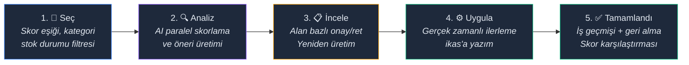
```mermaid
graph LR
    S1["1. 🎯 Seç<br/><i>Skor eşiği, kategori<br/>stok durumu filtresi</i>"] --> S2["2. 🔍 Analiz<br/><i>AI paralel skorlama<br/>ve öneri üretimi</i>"]
    S2 --> S3["3. 📋 İncele<br/><i>Alan bazlı onay/ret<br/>Yeniden üretim</i>"]
    S3 --> S4["4. ⚙️ Uygula<br/><i>Gerçek zamanlı ilerleme<br/>ikas'a yazım</i>"]
    S4 --> S5["5. ✅ Tamamlandı<br/><i>İş geçmişi + geri alma<br/>Skor karşılaştırması</i>"]

    style S1 fill:#1e293b,stroke:#3b82f6,color:#e2e8f0
    style S2 fill:#1e293b,stroke:#8b5cf6,color:#e2e8f0
    style S3 fill:#1e293b,stroke:#f59e0b,color:#e2e8f0
    style S4 fill:#1e293b,stroke:#10b981,color:#e2e8f0
    style S5 fill:#1e293b,stroke:#10b981,color:#e2e8f0
```

- **Threshold tabanlı filtreleme** — skor eşiği, kategori ve stok durumuna göre ürün seçimi
- **Toplu onay/ret** — tüm önerileri tek seferde ya da alan bazında onaylayın
- **Alan bazlı yeniden üretim** — beğenmediğiniz tek bir alanı yeniden oluşturun
- **Tam geri alma desteği** — tekil ürün veya tüm batch geri alınabilir

---

### 📄 llms.txt Studio

Tüm ürün kataloğunu ChatGPT, Perplexity ve Claude gibi AI motorlarının alıntılayabileceği **ansiklopedik özetlere** dönüştüren yönetilen iş kuyruğu. Çıktı standart `llms.txt` formatında export edilir.

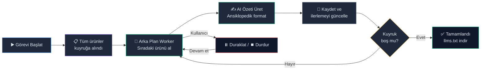
```mermaid
graph LR
    START["▶️ Görevi Başlat"] --> QUEUE["📋 Tüm ürünler\nkuyruğa alındı"]
    QUEUE --> WORKER["🤖 Arka Plan Worker\nSıradaki ürünü al"]
    WORKER --> AI["✍️ AI Özeti Üret\nAnsiklopedik format"]
    AI --> SAVE["💾 Kaydet ve\nilerlemeyi güncelle"]
    SAVE --> MORE{"Kuyruk\nboş mu?"}
    MORE -->|Hayır| WORKER
    MORE -->|Evet| DONE["✅ Tamamlandı\nllms.txt indir"]
    WORKER -->|Kullanıcı| CTRL["⏸️ Duraklat / ⏹️ Durdur"]
    CTRL -->|Devam et| WORKER

    style START fill:#1e293b,stroke:#3b82f6,color:#e2e8f0
    style QUEUE fill:#1e293b,stroke:#8b5cf6,color:#e2e8f0
    style WORKER fill:#1e293b,stroke:#10b981,color:#e2e8f0
    style AI fill:#1e293b,stroke:#10b981,color:#e2e8f0
    style SAVE fill:#1e293b,stroke:#64748b,color:#e2e8f0
    style MORE fill:#1e293b,stroke:#f59e0b,color:#e2e8f0
    style DONE fill:#0f172a,stroke:#10b981,color:#e2e8f0
    style CTRL fill:#0f172a,stroke:#ef4444,color:#e2e8f0
```

- **Start / Pause / Resume / Stop** kontrolleriyle async arka plan worker
- **Gerçek zamanlı sayaçlar** — toplam / işlendi / bekliyor / başarısız canlı takibi; stat kartları listeyi filtreler
- **Tekil yeniden üretim** — tek bir ürün özetini anında yeniden oluşturma
- **Kesintiden devam** — backend yeniden başlatılsa bile yarıda kalan iş otomatik sürdürülür
- **Tek tıkla indirme** — tüm özetler standart `llms.txt` formatında dışa aktarılır

<p align="center">
  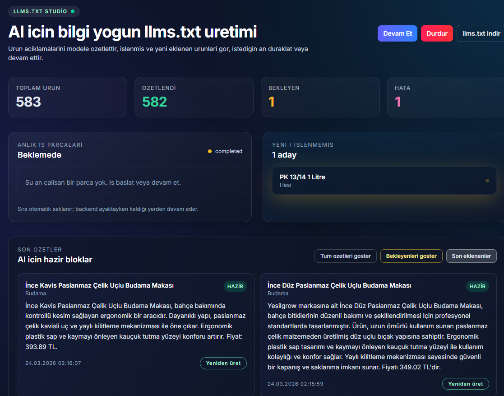
</p>

<p align="center"><i>Özet kuyrukları, son üretilen bloklar ve indirilebilir llms.txt çıktısı tek ekranda yönetilir</i></p>

---

### 🌐 GEO Site Denetimi

**Herhangi bir web sitesini** Generative Engine Optimization hazırlığı için denetleyen bağımsız tarayıcı:

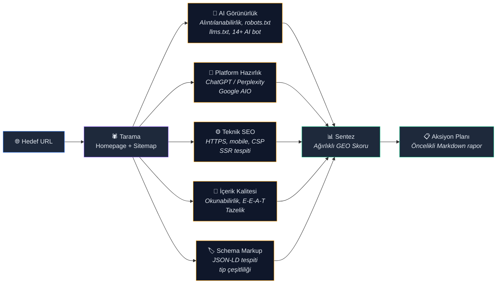
```mermaid
graph LR
    URL["🌐 Hedef URL"] --> CRAWL["🕷️ Tarama<br/>Homepage + Sitemap"]

    CRAWL --> A1["🤖 AI Görünürlük<br/><i>Alıntılanabilirlik, robots.txt<br/>llms.txt, 14+ AI bot</i>"]
    CRAWL --> A2["📱 Platform Hazırlık<br/><i>ChatGPT / Perplexity<br/>Google AIO</i>"]
    CRAWL --> A3["⚙️ Teknik SEO<br/><i>HTTPS, mobile, CSP<br/>SSR tespiti</i>"]
    CRAWL --> A4["📝 İçerik Kalitesi<br/><i>Okunabilirlik, E-E-A-T<br/>Tazelik</i>"]
    CRAWL --> A5["🏷️ Schema Markup<br/><i>JSON-LD tespiti<br/>tip çeşitliliği</i>"]

    A1 --> SYN["📊 Sentez<br/><i>Ağırlıklı GEO Skoru</i>"]
    A2 --> SYN
    A3 --> SYN
    A4 --> SYN
    A5 --> SYN

    SYN --> REPORT["📋 Aksiyon Planı<br/><i>Öncelikli Markdown rapor</i>"]

    style URL fill:#1e293b,stroke:#3b82f6,color:#e2e8f0
    style CRAWL fill:#1e293b,stroke:#8b5cf6,color:#e2e8f0
    style A1 fill:#0f172a,stroke:#f59e0b,color:#e2e8f0
    style A2 fill:#0f172a,stroke:#f59e0b,color:#e2e8f0
    style A3 fill:#0f172a,stroke:#f59e0b,color:#e2e8f0
    style A4 fill:#0f172a,stroke:#f59e0b,color:#e2e8f0
    style A5 fill:#0f172a,stroke:#f59e0b,color:#e2e8f0
    style SYN fill:#1e293b,stroke:#10b981,color:#e2e8f0
    style REPORT fill:#1e293b,stroke:#10b981,color:#e2e8f0
```

5 analiz ajanı `asyncio.gather` ile **paralel** çalışır. Sentez ağırlıkları:

| Kategori | Ağırlık |
|---|---|
| AI Alıntılanabilirlik / Görünürlük | %25 |
| Marka Otorite Sinyalleri | %20 |
| İçerik Kalitesi (E-E-A-T) | %20 |
| Teknik Altyapı | %15 |
| Yapılandırılmış Veri | %10 |
| Platform Optimizasyonu | %10 |

---

### 🎯 Skill Runtime & Studio

Skill'ler global bayrak değil — her skill, seçildiği akış için runtime'da eklenen bir **talimat paketidir**. Her skill `skills/<skill-slug>/` altında yaşar ve iki dosyadan oluşur: `meta.json` (metadata, araçlar, uygulanabilirlik) + `SKILL.md` (insan okunur talimatlar).

#### 3 Katmanlı Skill Dizini

```
skills/                   ← Sistem skill'leri (öncelik: 0)
├── category-audit/
├── brand-voice-rewrite/
├── launch-readiness/
├── project/              ← Proje kapsamlı skill'ler (öncelik: 1)
│   └── custom-seo-lens/
└── custom/               ← Kullanıcı skill'leri (öncelik: 2)
    └── my-brand-tone/
```

Aynı slug birden fazla katmanda varsa **yüksek öncelikli kaynak kazanır** — `custom` > `project` > `system`. Böylece yerleşik bir skill'i kendi sürümünüzle override edebilirsiniz.

#### Otomatik Skill Seçimi (Runtime Selection)

Skill her zaman elle seçilmek zorunda değil. Sistem **5 seçim modunu** destekler:

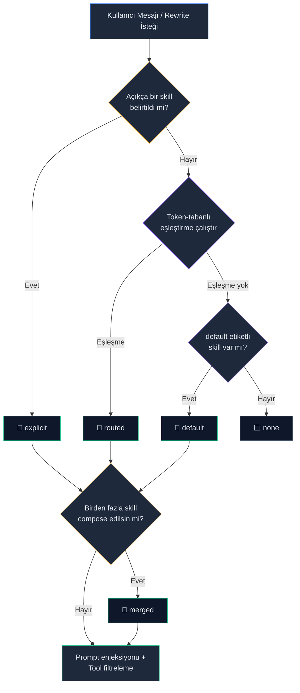
```mermaid
graph TD
    MSG["Kullanıcı Mesajı / Rewrite İsteği"] --> EXPLICIT{"Açıkça bir skill<br/>belirtildi mi?"}
    EXPLICIT -->|Evet| MODE_EX["🎯 explicit"]
    EXPLICIT -->|Hayır| ROUTING{"Token-tabanlı<br/>eşleştirme çalıştır"}
    ROUTING -->|Eşleşme| MODE_RT["🧭 routed"]
    ROUTING -->|Eşleşme yok| DEFAULT{"default etiketli<br/>skill var mı?"}
    DEFAULT -->|Evet| MODE_DF["📌 default"]
    DEFAULT -->|Hayır| MODE_NO["⬜ none"]

    MODE_EX --> MERGE{"Birden fazla skill<br/>compose edilsin mi?"}
    MODE_RT --> MERGE
    MODE_DF --> MERGE
    MERGE -->|Evet| MODE_MG["🔀 merged"]
    MERGE -->|Hayır| APPLY["Prompt enjeksiyonu +<br/>Tool filtreleme"]
    MODE_MG --> APPLY

    style MSG fill:#1e293b,stroke:#3b82f6,color:#e2e8f0
    style EXPLICIT fill:#1e293b,stroke:#f59e0b,color:#e2e8f0
    style ROUTING fill:#1e293b,stroke:#8b5cf6,color:#e2e8f0
    style DEFAULT fill:#1e293b,stroke:#8b5cf6,color:#e2e8f0
    style MODE_EX fill:#0f172a,stroke:#10b981,color:#e2e8f0
    style MODE_RT fill:#0f172a,stroke:#10b981,color:#e2e8f0
    style MODE_DF fill:#0f172a,stroke:#10b981,color:#e2e8f0
    style MODE_NO fill:#0f172a,stroke:#64748b,color:#e2e8f0
    style MODE_MG fill:#0f172a,stroke:#10b981,color:#e2e8f0
    style MERGE fill:#1e293b,stroke:#f59e0b,color:#e2e8f0
    style APPLY fill:#1e293b,stroke:#10b981,color:#e2e8f0
```

| Mod | Tetikleyen | Açıklama |
|---|---|---|
| `explicit` | Kullanıcı veya API parametresi | Doğrudan slug ile seçilmiş skill |
| `routed` | Token tabanlı eşleştirme | Mesaj/ürün içeriğindeki anahtar kelimeler skill'in `routing_keywords` alanıyla eşleşir |
| `default` | `default` etiketi | Hiçbir skill eşleşmezse `default` etiketli skill otomatik devreye girer |
| `merged` | Birden fazla skill bileşimi | Explicit + routed skill'ler tek bir prompt ve unified tool listiyle birleştirilir |
| `none` | Eşleşme/seçim yok | Skill katmanı eklenmez; varsayılan davranış |

**Token tabanlı yönlendirme** — Kullanıcı mesajı, ürün adı, kategorisi ve SEO sorunları bir `routing_text` olarak birleştirilir. Her skill'in `routing_keywords` alanına karşı kelime bazlı eşleştirme yapılır; en yüksek skor alan skill seçilir. Chat'te `operator` ajanı için routing devre dışı kalır.

**Permission-aware tool filtreleme** — Skill'in `allowed_tools` listesi flow'un gerçek tool setiyle ve permission engine'in `preview()` kararıyla kesiştirilir. Permission engine'den `deny` alan veya flow'da olmayan araçlar filtrelenir — skill tanımının ötesinde bir tool'a erişim sağlanamaz.

**Pozisyonlu prompt enjeksiyonu** — `compose_prompt_with_skill_layer()` skill prompt'unu flow'a özgü slot'a enjekte eder. Her flow (`chat`, `rewrite`, `batch`, `product_rewrite`) hangi katman pozisyonunda skill overlay'i alacağını `SKILL_PROMPT_LAYER_SLOTS` ile tanımlar.

#### Akışlarda Kullanım

| Akış | Nerede seçilir | Etki |
|---|---|---|
| **Chat** | Chat header, `/skill set <slug>` veya **Skill Studio → "Chat'te Uygula"** | System prompt'a eklenir + tool listesi filtrelenir |
| **Rewrite** | API çağrısında `?skill_slug=` | Rewrite system prompt'una eklenir |
| **Batch** | Batch config panelinde | Her alan üretimine ek talimat verir (prompt enjeksiyonu) |

Chat header'da aktif skill'in **seçim modu** (routed / default / merged), çözülmüş tool sayısı ve birleştirilmiş skill listesi gerçek zamanlı gösterilir.

**Skill Studio → Chat entegrasyonu** — Skill Studio'da "Chat'te Uygula ve Test Et" butonuna tıklayın; dashboard `?skill=<slug>` parametresiyle açılır ve skill otomatik olarak chat oturumuna bağlanır. Ürün seçmeden de test edebilirsiniz. Custom kaynaklı skill'ler studio'da **USER** rozeti ile işaretlenir.

**Varsayılan skill'ler** sistem açılışında otomatik seed edilir:
- `category-audit` — kategori uyumu ve alan bazlı SEO boşlukları
- `brand-voice-rewrite` — marka tonunu kontrollü ve tutarlı hale getiren lens
- `launch-readiness` — yayın öncesi checklist, eksik alan tespiti

**Preview debug paneli** — Preview çalıştırıldığında tool scope mode, prompt boyutu (char/word), requested vs resolved tool listesi, katman kaynakları (`prompt_layer_sources`) ve katman sayısı görsel olarak gösterilir.

**Güvenlik** — Skill dizinlerinde symlink koruması ve dosya allowlist'i uygulanır; `meta.json` ve `SKILL.md` dışındaki beklenmeyen dosyalar yok sayılır.

<p align="center">
  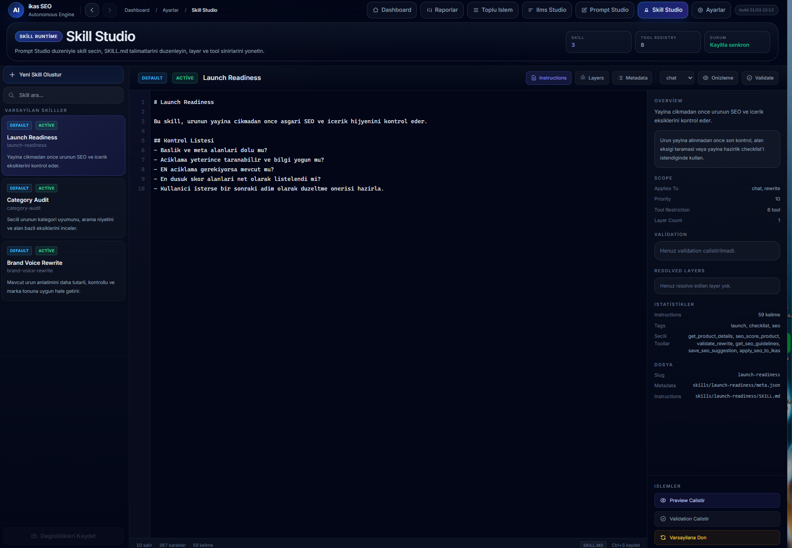
</p>

<p align="center"><i>Skill Studio ile skill metadata, debug preview, prompt layer kompozisyonu ve chat testi tek yerden yönetilir</i></p>

---

### 📝 Prompts Studio

Sistemdeki **tüm AI prompt şablonlarını** düzenleyip yönetebileceğiniz tam özellikli editör. Python dosyasına dokunmadan, Settings sayfasından canlı olarak her prompt'u güncelleyebilirsiniz.

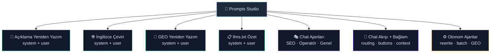
```mermaid
graph TD
    EDITOR["📝 Prompts Studio"] --> G1["📄 Açıklama Yeniden Yazım\nsystem + user"]
    EDITOR --> G2["🌐 İngilizce Çeviri\nsystem + user"]
    EDITOR --> G3["🤖 GEO Yeniden Yazım\nsystem + user"]
    EDITOR --> G4["📋 llms.txt Özet\nsystem + user"]
    EDITOR --> G5["🎭 Chat Ajanları\nSEO · Operatör · Genel"]
    EDITOR --> G6["💬 Chat Akışı + Bağlam\nrouting · buttons · context"]
    EDITOR --> G7["⚙️ Otonom Ajanlar\nrewrite · batch · GEO"]

    style EDITOR fill:#1e293b,stroke:#3b82f6,color:#e2e8f0
    style G1 fill:#0f172a,stroke:#10b981,color:#e2e8f0
    style G2 fill:#0f172a,stroke:#10b981,color:#e2e8f0
    style G3 fill:#0f172a,stroke:#10b981,color:#e2e8f0
    style G4 fill:#0f172a,stroke:#10b981,color:#e2e8f0
    style G5 fill:#0f172a,stroke:#8b5cf6,color:#e2e8f0
    style G6 fill:#0f172a,stroke:#8b5cf6,color:#e2e8f0
    style G7 fill:#0f172a,stroke:#f59e0b,color:#e2e8f0
```

- **7 grup, 20+ şablon** — ürün yeniden yazımı, çeviri, GEO, llms.txt özeti, chat personaları, akış bağlamı ve otonom ajan prompt'ları
- **`{{değişken}}` doğrulama** — tanımsız placeholder'da kayıt öncesi uyarı
- **Değişiklik takibi** — kaydedilmemiş prompt'lar görsel olarak işaretlenir; toplu kayıt
- **Varsayılana sıfırlama** — tekil veya tüm grubu tek tıkla varsayılana döndürme
- **Prompt katman görselleştirmesi** — hangi prompt'un hangi pipeline'da nasıl birleştiğini gösteren diyagram

<p align="center">
  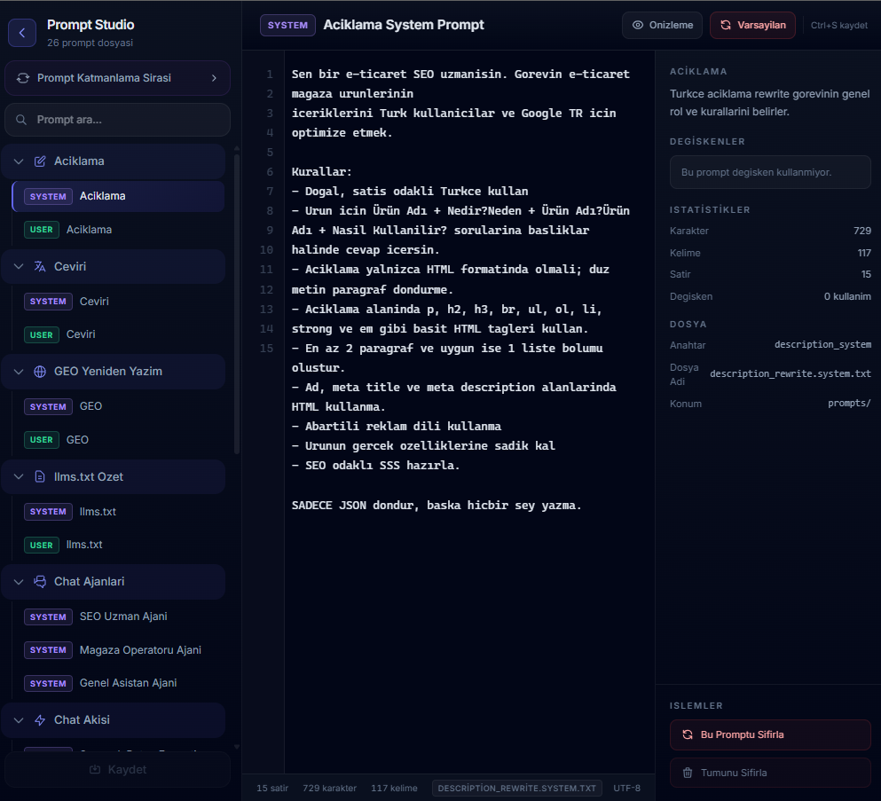
</p>

<p align="center"><i>Prompt Studio ile tüm sistem ve kullanıcı prompt'ları tek yerden düzenlenir</i></p>

---

### 🧠 Kalıcı Mağaza Hafızası

AI her seferinde sıfırdan başlamaz — mağazanızın **marka tonu, yasaklı iddialar, kategori sözlüğü ve onaylanmış tercihleri** kalıcı hafızada saklanır ve her AI isteğine otomatik enjekte edilir.

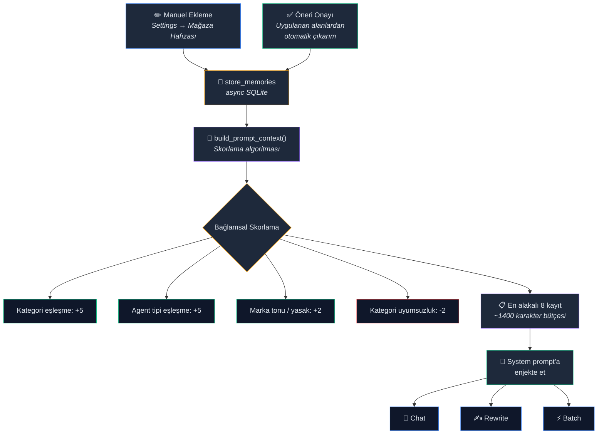
```mermaid
graph TD
    MANUAL["✏️ Manuel Ekleme<br/><i>Settings → Mağaza Hafızası</i>"] --> DB["💾 store_memories<br/><i>async SQLite</i>"]
    APPROVE["✅ Öneri Onayı<br/><i>Uygulanan alanlardan<br/>otomatik çıkarım</i>"] --> DB

    DB --> BUILD["🧮 build_prompt_context()<br/><i>Skorlama algoritması</i>"]

    BUILD --> SCORE{"Bağlamsal Skorlama"}
    SCORE --> S1["Kategori eşleşme: +5"]
    SCORE --> S2["Agent tipi eşleşme: +5"]
    SCORE --> S3["Marka tonu / yasak: +2"]
    SCORE --> S4["Kategori uyumsuzluk: -2"]

    SCORE --> SELECT["📋 En alakalı 8 kayıt<br/><i>~1400 karakter bütçesi</i>"]
    SELECT --> INJECT["📨 System prompt'a<br/>enjekte et"]

    INJECT --> CHAT["💬 Chat"]
    INJECT --> REWRITE["✍️ Rewrite"]
    INJECT --> BATCH["⚡ Batch"]

    style MANUAL fill:#1e293b,stroke:#3b82f6,color:#e2e8f0
    style APPROVE fill:#1e293b,stroke:#10b981,color:#e2e8f0
    style DB fill:#1e293b,stroke:#f59e0b,color:#e2e8f0
    style BUILD fill:#1e293b,stroke:#8b5cf6,color:#e2e8f0
    style SCORE fill:#1e293b,stroke:#f59e0b,color:#e2e8f0
    style S1 fill:#0f172a,stroke:#10b981,color:#e2e8f0
    style S2 fill:#0f172a,stroke:#10b981,color:#e2e8f0
    style S3 fill:#0f172a,stroke:#10b981,color:#e2e8f0
    style S4 fill:#0f172a,stroke:#ef4444,color:#e2e8f0
    style SELECT fill:#1e293b,stroke:#8b5cf6,color:#e2e8f0
    style INJECT fill:#1e293b,stroke:#10b981,color:#e2e8f0
    style CHAT fill:#0f172a,stroke:#3b82f6,color:#e2e8f0
    style REWRITE fill:#0f172a,stroke:#3b82f6,color:#e2e8f0
    style BATCH fill:#0f172a,stroke:#3b82f6,color:#e2e8f0
```

#### 5 Hafıza Tipi

| Tip | Açıklama | Örnek |
|---|---|---|
| **brand_tone** | Marka ses tonu kuralları | "Premium ama sakin ton, ünlem kullanma" |
| **forbidden_claim** | Kaçınılması gereken ifadeler | "FDA onayı olmadan tıbbi iddia yapma" |
| **category_glossary** | Kategori bazlı terminoloji | "Ayakkabı kategorisinde 'koleksiyon' kullan" |
| **approved_preference** | Onaylanmış alan değerleri (otomatik) | "Meta başlık formatı: Ürün Adı \| Marka" |
| **operation_note** | Ajan operasyon talimatları | "Stok 0 olan ürünlerde fiyat güncelleme" |

#### Otomatik Hafıza Çıkarımı

Bir öneriyi onaylayıp ikas'a uyguladığınızda sistem otomatik olarak:
1. Uygulanan her alan için `approved_preference` kaydı oluşturur
2. Kategori kapsamında saklar — benzer ürünlerde referans olarak kullanılır
3. Hash tabanlı tekilleştirme yapar — aynı alan/kategori/değer tekrarlanmaz

#### Akıllı Seçim Algoritması

Her AI isteğinde tüm hafıza değil, **bağlamsal olarak en alakalı kayıtlar** seçilir:
- Ürünün kategorisiyle eşleşen kayıtlar önceliklidir (+5 skor)
- Agent tipine uygun kayıtlar öne çıkar (operatör ise `operation_note` +5)
- Marka tonu ve yasaklı iddialar her zaman dahil edilir (+2)
- Farklı kategorideki `approved_preference` kayıtları geri planda kalır (-2)
- Maks 8 kayıt, ~1400 karakter bütçesiyle truncate edilir

Sonuç: AI her üründe **mağazanızı tanıyan, tutarlı ve markanıza uygun** içerik üretir.

---

### 📈 SEO/GEO Raporlama

Skor geçmişini izleyen ve iyileşmeleri görselleştiren analitik dashboard:

- **Trend grafikleri** — 7/30/90/365 günlük dönemlerde mağaza geneli skor eğrisi
- **Alt-skor karşılaştırması** — ilk ve son anlık görüntü arasında 10+ boyutta bar grafiği
- **En çok gelişenler** — skor artışına göre sıralı ürün listesi
- **Ürün bazlı drilldown** — her ürünün kendi trend grafiği
- **Skor değişikliği günlüğü** — her operasyonun ürün × alan × delta bazında olay kaydı
- **Anlık görüntü** — karşılaştırma için mevcut durumu elle kaydedin

<p align="center">
  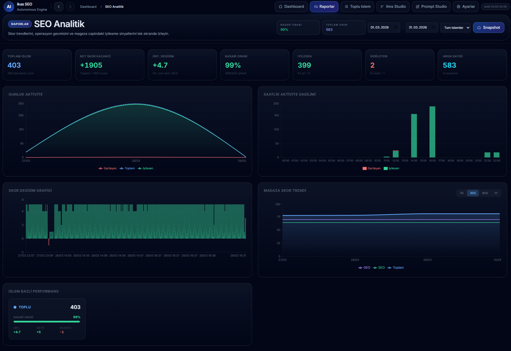
</p>

---

### 🔌 Provider Agnostik

Tek kod tabanı, **8 AI sağlayıcı**:

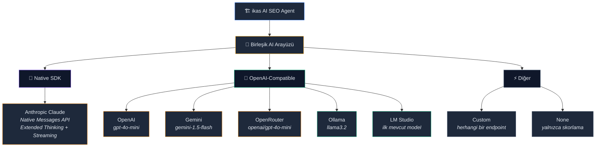
```mermaid
graph TD
    APP["🏗️ ikas AI SEO Agent"] --> UNIFIED["🔌 Birleşik AI Arayüzü"]

    UNIFIED --> NATIVE["🎯 Native SDK"]
    UNIFIED --> COMPAT["🔌 OpenAI-Compatible"]
    UNIFIED --> OTHER["⚡ Diğer"]

    NATIVE --> C1["Anthropic Claude<br/><i>Native Messages API<br/>Extended Thinking + Streaming</i>"]
    COMPAT --> C2["OpenAI<br/><i>gpt-4o-mini</i>"]
    COMPAT --> C3["Gemini<br/><i>gemini-1.5-flash</i>"]
    COMPAT --> C4["OpenRouter<br/><i>openai/gpt-4o-mini</i>"]
    COMPAT --> L1["Ollama<br/><i>llama3.2</i>"]
    COMPAT --> L2["LM Studio<br/><i>ilk mevcut model</i>"]

    OTHER --> O1["Custom<br/><i>herhangi bir endpoint</i>"]
    OTHER --> O2["None<br/><i>yalnızca skorlama</i>"]

    style APP fill:#1e293b,stroke:#3b82f6,color:#e2e8f0
    style UNIFIED fill:#1e293b,stroke:#f59e0b,color:#e2e8f0
    style NATIVE fill:#0f172a,stroke:#8b5cf6,color:#e2e8f0
    style COMPAT fill:#0f172a,stroke:#10b981,color:#e2e8f0
    style OTHER fill:#0f172a,stroke:#64748b,color:#e2e8f0
    style C1 fill:#1e293b,stroke:#d97706,color:#e2e8f0
    style C2 fill:#1e293b,stroke:#d97706,color:#e2e8f0
    style C3 fill:#1e293b,stroke:#d97706,color:#e2e8f0
    style C4 fill:#1e293b,stroke:#d97706,color:#e2e8f0
    style L1 fill:#1e293b,stroke:#059669,color:#e2e8f0
    style L2 fill:#1e293b,stroke:#059669,color:#e2e8f0
    style O1 fill:#1e293b,stroke:#475569,color:#e2e8f0
    style O2 fill:#1e293b,stroke:#475569,color:#e2e8f0
```

Bir ortam değişkeni değiştirin — tüm agentic pipeline, chat sistemi ve streaming aynı şekilde çalışır.

**Anthropic Claude özel entegrasyonu:** Native Anthropic SDK ile tam entegre — extended thinking (derin akıl yürütme), streaming yanıtlar, istek iptali ve model bazlı maliyet takibi. Diğer sağlayıcılar birleşik OpenAI-compatible arayüz üzerinden tool calling destekler.

| Model | Kullanım | Maliyet (1M token) |
|---|---|---|
| `claude-haiku-4-5-20251001` | Varsayılan — hızlı ve ekonomik | $0.80 input / $4.0 output |
| `claude-sonnet-4-20250514` | Dengeli performans | $3.0 input / $15.0 output |
| `claude-opus-4-20250514` | Maksimum kalite | $15.0 input / $75.0 output |

---

### 🔒 Güvenlik & İzinler

**`DRY_RUN=true` varsayılandır** — siz açıkça izin vermeden ikas mağazanıza hiçbir şey yazılmaz. Her öneri, uygulanmadan önce bir insan onay adımından geçer.

Yazma etkisi olan tüm kritik akışlar **merkezi permission engine** üzerinden geçer:

- **Risk sınıfları** — `apply`, `rollback`, `bulk_apply`, `db_reset`, `external_write`
- **Karar modeli** — `allow`, `ask`, `deny` ile kural çözümleme: global → project → session → runtime override
- **Zorunlu preflight kontrolü** — tool handler veya servis çalışmadan önce izin kararı verilir
- **Senkron preview** — `preview()` ile async olmadan izin kararı alınır; skill runtime tool filtrelemesinde kullanılır (audit log'a yazmaz)
- **Audit kaydı** — onay gerektiren tüm kararlar `permission_audit_log` tablosuna yazılır
- **REST çevirisi** — izin yoksa `409 approval required` veya `403 denied` döner
- **Sahte-eylem güvenliği** — LLM tool çağırmadan "uyguladım" derse sistem tespit edip uyarı ekler

---

## Mimari

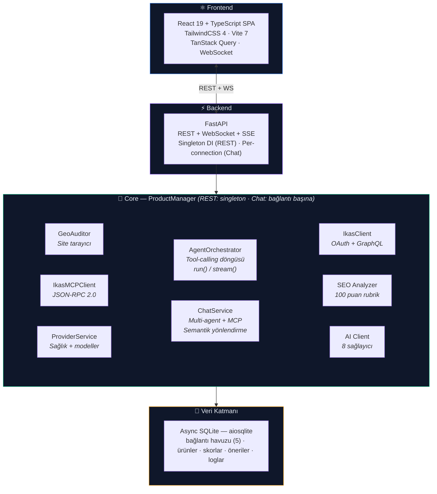
```mermaid
graph TB
    subgraph FRONTEND ["⚛️ Frontend"]
        FE["React 19 + TypeScript SPA<br/>TailwindCSS 4 · Vite 7<br/>TanStack Query · WebSocket"]
    end

    subgraph BACKEND ["⚡ Backend"]
        API["FastAPI<br/>REST + WebSocket + SSE<br/>Singleton DI (REST) · Per-connection (Chat)"]
    end

    subgraph CORE ["🧠 Core — ProductManager <i>(REST: singleton · Chat: bağlantı başına)</i>"]
        direction TB
        subgraph ROW1 [" "]
            IKAS_C["IkasClient<br/><i>OAuth + GraphQL</i>"]
            SEO_A["SEO Analyzer<br/><i>100 puan rubrik</i>"]
            AI_C["AI Client<br/><i>8 sağlayıcı</i>"]
        end
        subgraph ROW2 [" "]
            AGENT["AgentOrchestrator<br/><i>Tool-calling döngüsü<br/>run() / stream()</i>"]
            CHAT["ChatService<br/><i>Multi-agent + MCP<br/>Semantik yönlendirme</i>"]
        end
        subgraph ROW3 [" "]
            GEO["GeoAuditor<br/><i>Site tarayıcı</i>"]
            MCP["IkasMCPClient<br/><i>JSON-RPC 2.0</i>"]
            PROV["ProviderService<br/><i>Sağlık + modeller</i>"]
        end
    end

    subgraph DATA ["💾 Veri Katmanı"]
        DB["Async SQLite — aiosqlite<br/>bağlantı havuzu (5) · ürünler · skorlar · öneriler · loglar"]
    end

    FE <-->|REST + WS| API
    API --> CORE
    CORE --> DATA

    style FRONTEND fill:#0f172a,stroke:#3b82f6,color:#e2e8f0
    style BACKEND fill:#0f172a,stroke:#8b5cf6,color:#e2e8f0
    style CORE fill:#0f172a,stroke:#10b981,color:#e2e8f0
    style DATA fill:#0f172a,stroke:#f59e0b,color:#e2e8f0
    style ROW1 fill:transparent,stroke:transparent
    style ROW2 fill:transparent,stroke:transparent
    style ROW3 fill:transparent,stroke:transparent
```

### Tasarım Kararları

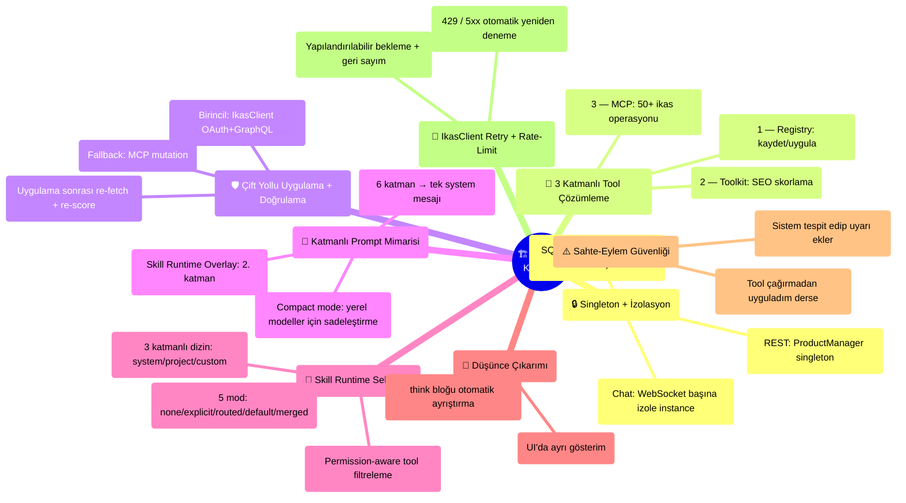
```mermaid
mindmap
  root(("🏗️ Tasarım<br/>Kararları"))
    ("🔒 Singleton + İzolasyon")
      ("REST: ProductManager singleton")
      ("Chat: WebSocket başına izole instance")
      ("SQLite bağlantı havuzu (5 conn)")
    ("🔧 3 Katmanlı Tool Çözümleme")
      ("1 — Registry: kaydet/uygula")
      ("2 — Toolkit: SEO skorlama")
      ("3 — MCP: 50+ ikas operasyonu")
    ("🛡️ Çift Yollu Uygulama + Doğrulama")
      ("Birincil: IkasClient OAuth+GraphQL")
      ("Fallback: MCP mutation")
      ("Uygulama sonrası re-fetch + re-score")
    ("📝 Katmanlı Prompt Mimarisi")
      ("6 katman → tek system mesajı")
      ("Skill Runtime Overlay: 2. katman")
      ("Compact mode: yerel modeller için sadeleştirme")
    ("🎯 Skill Runtime Selection")
      ("5 mod: none/explicit/routed/default/merged")
      ("3 katmanlı dizin: system/project/custom")
      ("Permission-aware tool filtreleme")
    ("🧠 Düşünce Çıkarımı")
      ("think bloğu otomatik ayrıştırma")
      ("UI'da ayrı gösterim")
    ("⚠️ Sahte-Eylem Güvenliği")
      ("Tool çağırmadan uyguladım derse")
      ("Sistem tespit edip uyarı ekler")
    ("🔁 IkasClient Retry + Rate-Limit")
      ("429 / 5xx otomatik yeniden deneme")
      ("Yapılandırılabilir bekleme + geri sayım")
```

### Chat Mesaj İşleme Akışı

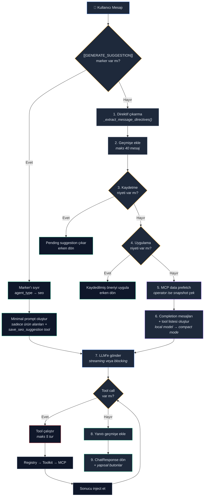
```mermaid
graph TD
    INPUT["💬 Kullanıcı Mesajı"] --> GEN_CHECK{"[[GENERATE_SUGGESTION]]<br/>marker var mı?"}

    GEN_CHECK -->|Evet| GEN_STRIP["Marker'ı sıyır<br/>agent_type → seo"]
    GEN_STRIP --> GEN_BUILD["Minimal prompt oluştur<br/><i>sadece ürün alanları +<br/>save_seo_suggestion tool</i>"]
    GEN_BUILD --> LLM_CALL

    GEN_CHECK -->|Hayır| EXTRACT["1. Direktif çıkarma<br/><i>_extract_message_directives()</i>"]
    EXTRACT --> HISTORY["2. Geçmişe ekle<br/><i>maks 40 mesaj</i>"]
    HISTORY --> SAVE{"3. Kaydetme<br/>niyeti var mı?"}

    SAVE -->|Evet| DRAFT["Pending suggestion çıkar<br/>erken dön"]
    SAVE -->|Hayır| APPLY{"4. Uygulama<br/>niyeti var mı?"}

    APPLY -->|Evet| WRITE["Kaydedilmiş öneriyi uygula<br/>erken dön"]
    APPLY -->|Hayır| PREFETCH["5. MCP data prefetch<br/><i>operator ise snapshot çek</i>"]

    PREFETCH --> BUILD["6. Completion mesajları<br/>+ tool listesi oluştur<br/><i>local model → compact mode</i>"]
    BUILD --> LLM_CALL["7. LLM'e gönder<br/><i>streaming veya blocking</i>"]

    LLM_CALL --> TOOL_LOOP{"Tool call<br/>var mı?"}
    TOOL_LOOP -->|Evet| EXEC["Tool çalıştır<br/><i>maks 5 tur</i>"]
    EXEC --> RESOLVE["Registry → Toolkit → MCP"]
    RESOLVE --> INJECT["Sonucu inject et"]
    INJECT --> TOOL_LOOP

    TOOL_LOOP -->|Hayır| RESPONSE["8. Yanıtı geçmişe ekle"]
    RESPONSE --> RETURN["9. ChatResponse dön<br/><i>+ yapısal butonlar</i>"]

    style INPUT fill:#1e293b,stroke:#3b82f6,color:#e2e8f0
    style GEN_CHECK fill:#1e293b,stroke:#f59e0b,color:#e2e8f0
    style GEN_STRIP fill:#0f172a,stroke:#10b981,color:#e2e8f0
    style GEN_BUILD fill:#0f172a,stroke:#10b981,color:#e2e8f0
    style EXTRACT fill:#1e293b,stroke:#64748b,color:#e2e8f0
    style HISTORY fill:#1e293b,stroke:#64748b,color:#e2e8f0
    style SAVE fill:#1e293b,stroke:#f59e0b,color:#e2e8f0
    style APPLY fill:#1e293b,stroke:#f59e0b,color:#e2e8f0
    style DRAFT fill:#0f172a,stroke:#10b981,color:#e2e8f0
    style WRITE fill:#0f172a,stroke:#10b981,color:#e2e8f0
    style PREFETCH fill:#1e293b,stroke:#8b5cf6,color:#e2e8f0
    style BUILD fill:#1e293b,stroke:#8b5cf6,color:#e2e8f0
    style LLM_CALL fill:#1e293b,stroke:#3b82f6,color:#e2e8f0
    style TOOL_LOOP fill:#1e293b,stroke:#f59e0b,color:#e2e8f0
    style EXEC fill:#0f172a,stroke:#ef4444,color:#e2e8f0
    style RESOLVE fill:#0f172a,stroke:#64748b,color:#e2e8f0
    style INJECT fill:#0f172a,stroke:#64748b,color:#e2e8f0
    style RESPONSE fill:#1e293b,stroke:#10b981,color:#e2e8f0
    style RETURN fill:#1e293b,stroke:#10b981,color:#e2e8f0
```

> **Compact Mode:** LM Studio ve Ollama gibi yerel modeller için sistem prompt'u otomatik sadeleştirilir — verbose örnekler, operasyon rehberi ve routing talimatları kaldırılır. `[[GENERATE_SUGGESTION]]` isteklerinde ise yalnızca ürün alanları ve `save_seo_suggestion` tool'u gönderilir (~500 token vs ~10K).

### Tool Çözümleme Hiyerarşisi

Tool runtime ortak bir `ToolDefinition` modeli üzerinden çalışır. Hem agent hem chat-local tool'ları merkezi registry tarafından expose edilir; görünürlük allowlist ile filtrelenir ve tüm tool sonuçları tek tip `{ok, tool_name, data, error, meta}` envelope'u ile döner.

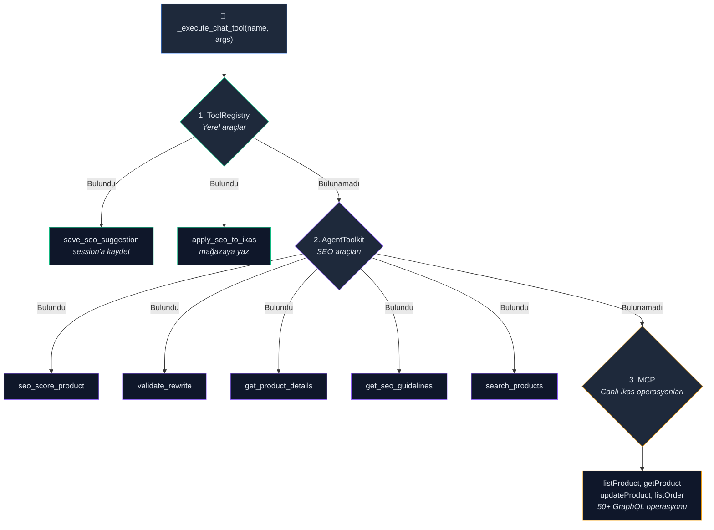
```mermaid
graph TD
    CALL["🔧 _execute_chat_tool(name, args)"] --> L1{"1. ToolRegistry<br/><i>Yerel araçlar</i>"}

    L1 -->|Bulundu| R1["save_seo_suggestion<br/><i>session'a kaydet</i>"]
    L1 -->|Bulundu| R2["apply_seo_to_ikas<br/><i>mağazaya yaz</i>"]

    L1 -->|Bulunamadı| L2{"2. AgentToolkit<br/><i>SEO araçları</i>"}

    L2 -->|Bulundu| T1["seo_score_product"]
    L2 -->|Bulundu| T2["validate_rewrite"]
    L2 -->|Bulundu| T3["get_product_details"]
    L2 -->|Bulundu| T4["get_seo_guidelines"]
    L2 -->|Bulundu| T5["search_products"]

    L2 -->|Bulunamadı| L3{"3. MCP<br/><i>Canlı ikas operasyonları</i>"}

    L3 --> M1["listProduct, getProduct<br/>updateProduct, listOrder<br/><i>50+ GraphQL operasyonu</i>"]

    style CALL fill:#1e293b,stroke:#3b82f6,color:#e2e8f0
    style L1 fill:#1e293b,stroke:#10b981,color:#e2e8f0
    style L2 fill:#1e293b,stroke:#8b5cf6,color:#e2e8f0
    style L3 fill:#1e293b,stroke:#f59e0b,color:#e2e8f0
    style R1 fill:#0f172a,stroke:#10b981,color:#e2e8f0
    style R2 fill:#0f172a,stroke:#10b981,color:#e2e8f0
    style T1 fill:#0f172a,stroke:#8b5cf6,color:#e2e8f0
    style T2 fill:#0f172a,stroke:#8b5cf6,color:#e2e8f0
    style T3 fill:#0f172a,stroke:#8b5cf6,color:#e2e8f0
    style T4 fill:#0f172a,stroke:#8b5cf6,color:#e2e8f0
    style T5 fill:#0f172a,stroke:#8b5cf6,color:#e2e8f0
    style M1 fill:#0f172a,stroke:#f59e0b,color:#e2e8f0
```

### Çift Yollu Uygulama Stratejisi

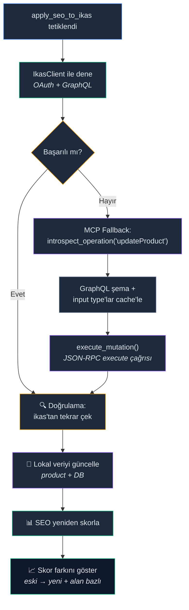
```mermaid
graph TD
    TRIGGER["apply_seo_to_ikas tetiklendi"] --> TRY["IkasClient ile dene<br/><i>OAuth + GraphQL</i>"]
    TRY --> CHECK{Başarılı mı?}

    CHECK -->|Evet| VERIFY
    CHECK -->|Hayır| INTROSPECT["MCP Fallback:<br/>introspect_operation('updateProduct')"]
    INTROSPECT --> CACHE["GraphQL şema +<br/>input type'lar cache'le"]
    CACHE --> MUTATION["execute_mutation()<br/><i>JSON-RPC execute çağrısı</i>"]
    MUTATION --> VERIFY

    VERIFY["🔍 Doğrulama:<br/>ikas'tan tekrar çek"] --> UPDATE["💾 Lokal veriyi güncelle<br/><i>product + DB</i>"]
    UPDATE --> RESCORE["📊 SEO yeniden skorla"]
    RESCORE --> DELTA["📈 Skor farkını göster<br/><i>eski → yeni + alan bazlı</i>"]

    style TRIGGER fill:#1e293b,stroke:#3b82f6,color:#e2e8f0
    style TRY fill:#1e293b,stroke:#10b981,color:#e2e8f0
    style CHECK fill:#1e293b,stroke:#f59e0b,color:#e2e8f0
    style INTROSPECT fill:#1e293b,stroke:#8b5cf6,color:#e2e8f0
    style CACHE fill:#1e293b,stroke:#64748b,color:#e2e8f0
    style MUTATION fill:#1e293b,stroke:#8b5cf6,color:#e2e8f0
    style VERIFY fill:#1e293b,stroke:#f59e0b,color:#e2e8f0
    style UPDATE fill:#1e293b,stroke:#8b5cf6,color:#e2e8f0
    style RESCORE fill:#1e293b,stroke:#10b981,color:#e2e8f0
    style DELTA fill:#0f172a,stroke:#10b981,color:#e2e8f0
```

### Prompt Katmanları

Tüm katmanlar **tek bir `system` mesajında** birleştirilir (qwen, llama gibi modellerin jinja template'leri birden fazla system mesajını desteklemez).

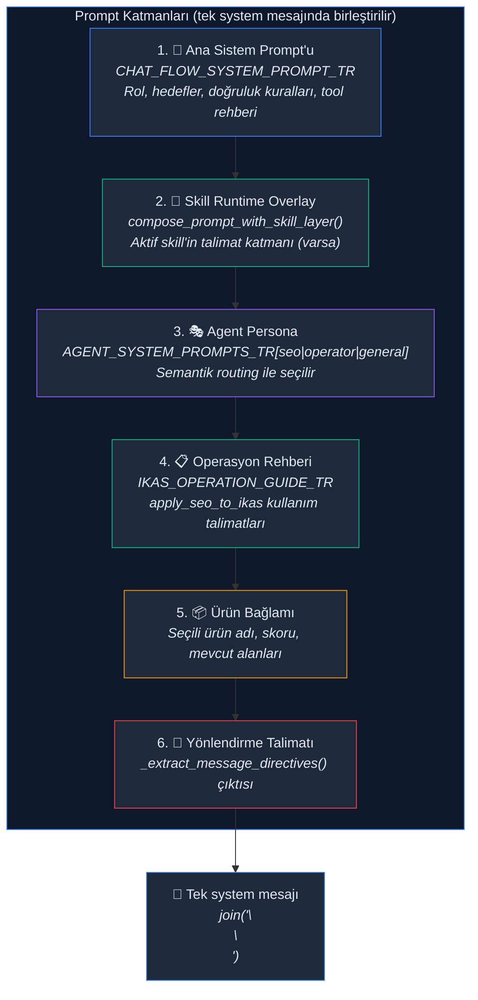
```mermaid
graph TB
    subgraph LAYERS ["Prompt Katmanları (tek system mesajında birleştirilir)"]
        P1["1. 📜 Ana Sistem Prompt'u<br/><i>CHAT_FLOW_SYSTEM_PROMPT_TR<br/>Rol, hedefler, doğruluk kuralları, tool rehberi</i>"]
        PSK["2. 🎯 Skill Runtime Overlay<br/><i>compose_prompt_with_skill_layer()<br/>Aktif skill'in talimat katmanı (varsa)</i>"]
        P2["3. 🎭 Agent Persona<br/><i>AGENT_SYSTEM_PROMPTS_TR[seo|operator|general]<br/>Semantik routing ile seçilir</i>"]
        P3["4. 📋 Operasyon Rehberi<br/><i>IKAS_OPERATION_GUIDE_TR<br/>apply_seo_to_ikas kullanım talimatları</i>"]
        P4["5. 📦 Ürün Bağlamı<br/><i>Seçili ürün adı, skoru, mevcut alanları</i>"]
        P5["6. 🧭 Yönlendirme Talimatı<br/><i>_extract_message_directives() çıktısı</i>"]
    end

    P1 --> PSK --> P2 --> P3 --> P4 --> P5
    P5 --> MERGE["📨 Tek system mesajı<br/><i>join('\\n\\n')</i>"]

    style LAYERS fill:#0f172a,stroke:#3b82f6,color:#e2e8f0
    style P1 fill:#1e293b,stroke:#3b82f6,color:#e2e8f0
    style PSK fill:#1e293b,stroke:#10b981,color:#e2e8f0
    style P2 fill:#1e293b,stroke:#8b5cf6,color:#e2e8f0
    style P3 fill:#1e293b,stroke:#10b981,color:#e2e8f0
    style P4 fill:#1e293b,stroke:#f59e0b,color:#e2e8f0
    style P5 fill:#1e293b,stroke:#ef4444,color:#e2e8f0
    style MERGE fill:#1e293b,stroke:#3b82f6,color:#e2e8f0
```

> **Compact Mode (Yerel Modeller):** LM Studio ve Ollama'da 4. ve 6. katman atlanır, verbose tool talimatları kaldırılır. ~10K token yerine ~2-3K token'lık minimal prompt gönderilir. Skill runtime overlay (2. katman) her zaman dahil edilir.

### Unified Task Runtime

Uzun süren `llms` ve `batch` operasyonları ortak bir task lifecycle modeliyle izlenir:

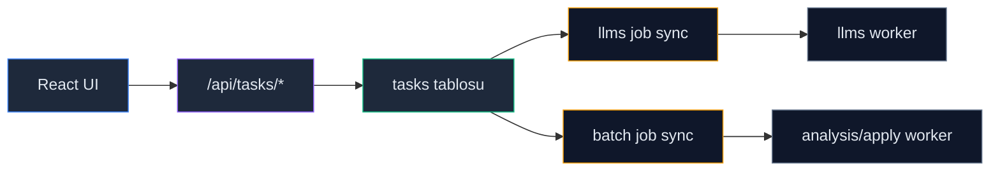
```mermaid
graph LR
    UI["React UI"] --> API["/api/tasks/*"]
    API --> TASKS["tasks tablosu"]
    TASKS --> LLMS["llms job sync"]
    TASKS --> BATCH["batch job sync"]
    LLMS --> WORKER1["llms worker"]
    BATCH --> WORKER2["analysis/apply worker"]

    style UI fill:#1e293b,stroke:#3b82f6,color:#e2e8f0
    style API fill:#1e293b,stroke:#8b5cf6,color:#e2e8f0
    style TASKS fill:#1e293b,stroke:#10b981,color:#e2e8f0
    style LLMS fill:#0f172a,stroke:#f59e0b,color:#e2e8f0
    style BATCH fill:#0f172a,stroke:#f59e0b,color:#e2e8f0
    style WORKER1 fill:#0f172a,stroke:#64748b,color:#e2e8f0
    style WORKER2 fill:#0f172a,stroke:#64748b,color:#e2e8f0
```

- **Tek tip lifecycle** — `queued`, `running`, `paused`, `failed`, `completed`, `cancelled`, `stopped`
- **Ortak kontrol yüzeyi** — `resume`, `retry`, `stop`, `cancel`, `get status`
- **Heartbeat ve progress standardı** — frontend canlı durum kartları aynı veri modeliyle beslenir
- **Geriye dönük uyumluluk** — `llms_jobs` ve `batch_jobs` korunur, ama ortak task kaydıyla senkronize çalışır

### Konfigürasyon Çözümleme

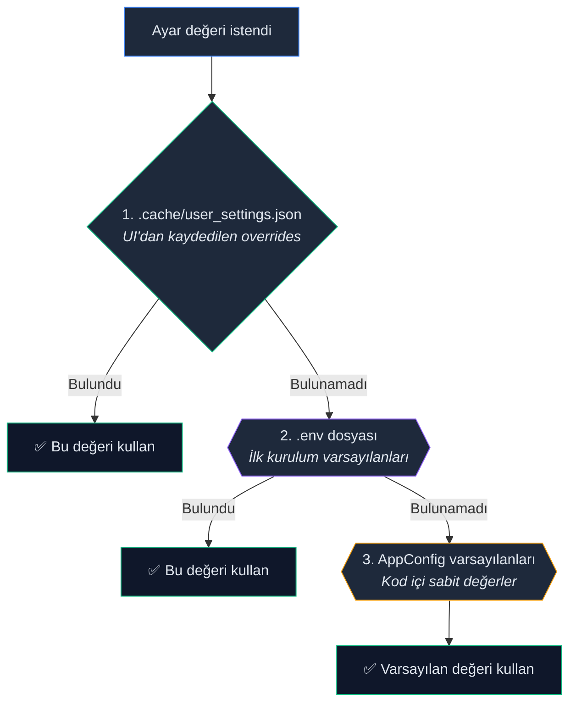
```mermaid
graph TD
    REQ["Ayar değeri istendi"] --> L1{"1. .cache/user_settings.json<br/><i>UI'dan kaydedilen overrides</i>"}

    L1 -->|Bulundu| USE1["✅ Bu değeri kullan"]
    L1 -->|Bulunamadı| L2{{"2. .env dosyası<br/><i>İlk kurulum varsayılanları</i>"}}

    L2 -->|Bulundu| USE2["✅ Bu değeri kullan"]
    L2 -->|Bulunamadı| L3{{"3. AppConfig varsayılanları<br/><i>Kod içi sabit değerler</i>"}}

    L3 --> USE3["✅ Varsayılan değeri kullan"]

    style REQ fill:#1e293b,stroke:#3b82f6,color:#e2e8f0
    style L1 fill:#1e293b,stroke:#10b981,color:#e2e8f0
    style L2 fill:#1e293b,stroke:#8b5cf6,color:#e2e8f0
    style L3 fill:#1e293b,stroke:#f59e0b,color:#e2e8f0
    style USE1 fill:#0f172a,stroke:#10b981,color:#e2e8f0
    style USE2 fill:#0f172a,stroke:#10b981,color:#e2e8f0
    style USE3 fill:#0f172a,stroke:#10b981,color:#e2e8f0
```

---

## Konfigürasyon

### Zorunlu

| Değişken | Açıklama |
|---|---|
| `IKAS_STORE_NAME` | ikas mağaza alt alan adı |
| `IKAS_CLIENT_ID` | ikas admin panelinden OAuth2 client ID |
| `IKAS_CLIENT_SECRET` | OAuth2 client secret |
| `AI_PROVIDER` | `anthropic`, `openai`, `gemini`, `openrouter`, `ollama`, `lm-studio`, `custom` veya `none` |
| `AI_API_KEY` | Bulut sağlayıcılar için API anahtarı |

### Opsiyonel

| Değişken | Varsayılan | Açıklama |
|---|---|---|
| `AI_MODEL_NAME` | Provider varsayılanı | Model seçimini geçersiz kıl |
| `AI_TEMPERATURE` | `0.7` | Üretim yaratıcılığı |
| `AI_MAX_TOKENS` | `2000` | Maks çıktı token |
| `AI_THINKING_MODE_CHAT` | `false` | Chat için extended thinking (Anthropic — `temperature=1` zorunlu, budget otomatik) |
| `AI_THINKING_MODE_BATCH` | `false` | Batch/agentic rewrite için extended thinking |
| `IKAS_MCP_TOKEN` | — | Chat'te canlı mağaza sorgularını etkinleştirir |
| `STORE_LANGUAGES` | `tr,en` | Desteklenen içerik dilleri |
| `SEO_TARGET_KEYWORDS` | — | Virgülle ayrılmış hedef anahtar kelimeler |
| `SEO_LOW_SCORE_THRESHOLD` | `70` | Ürünlerin dikkat gerektirdiği skor eşiği |
| `DRY_RUN` | `true` | ikas'a yazmak için `false` yapın |

---

## Teknoloji Yığını

### Backend
- **Python 3.11+** — async-first, `asyncio`
- **FastAPI** — REST API + WebSocket
- **aiosqlite** — async SQLite
- **httpx** — async HTTP (ikas GraphQL + MCP)
- **Pydantic v2** — veri doğrulama ve serileştirme

### Frontend
- **React 19** + **TypeScript 5.9**
- **Vite 7** — dev server + production build
- **TailwindCSS 4** — utility-first stil
- **TanStack Query 5** — sunucu durum yönetimi
- **React Router 7** — istemci tarafı routing
- **react-markdown** — chat mesaj renderlama

### Protokoller
- **OAuth2** — ikas API kimlik doğrulama
- **GraphQL** — ikas ürün CRUD
- **JSON-RPC 2.0** — ikas MCP (Model Context Protocol)
- **OpenAI-compatible** — birleşik AI sağlayıcı arayüzü
- **SSE** — gerçek zamanlı agent progress streaming
- **WebSocket** — çift yönlü chat

---

## Proje Yapısı

```
ikas-ai-seo-agent/
├── main.py                     # Giriş noktası
├── start.py                    # Backend/frontend koordinatörü
├── config/settings.py          # 3 katmanlı konfigürasyon çözümleme
│
├── core/                       # İş mantığı — UI bağımlılığı yok
│   ├── models.py               # Pydantic modeller (Product, SeoScore, AgentEvent, vb.)
│   ├── product_manager.py      # Merkezi orkestratör + permission guard'ları
│   ├── prompt_store.py         # Template yükleme + multi-agent prompt'lar
│   ├── permissions/            # Permission / approval engine + rule modeli
│   ├── tasks/                  # Unified task runtime + resume/retry/stop servisleri
│   ├── skills/                 # 3 katmanlı skill runtime: system/project/custom + routing + merging
│   ├── ai/client.py            # Multi-provider AI soyutlaması (fabrika + adaptörler)
│   ├── agent/                  # AgentOrchestrator (run + stream) + tool tanımları
│   ├── chat/                   # Çok turlu chat (state, streaming, suggestions, guidance)
│   ├── seo/                    # Skorlama motoru + GEO denetim pipeline'ı
│   ├── clients/                # IkasClient (OAuth+GraphQL) + IkasMCPClient (JSON-RPC)
│   ├── services/               # Provider sağlık, ayarlar, öneriler, günlük tracker, mağaza hafızası
│   └── utils/                  # HTML işleme, sunum yardımcıları
│
├── api/                        # FastAPI REST + WebSocket
│   ├── main.py                 # Uygulama kurulumu, CORS, SPA sunumu
│   ├── dependencies.py         # Singleton ProductManager (REST) + per-connection (Chat)
│   ├── permissions.py          # PermissionDecisionError → HTTPException çevirici
│   └── routers/                # products, seo, suggestions, settings, chat, batch, llms, tasks, reports
│
├── web/src/                    # React/TypeScript SPA
│   ├── pages/                  # Dashboard, LlmsLab, BatchOperations, Reports, PromptEditor, SkillStudio, Settings
│   ├── components/             # ChatPanel, ProductTable, ScoreCard, chat/messages/, dashboard/, tasks/
│   ├── shared/                 # score/scoreUtils, ui/ (Toast, ConfirmDialog, Modal, ProgressBar)
│   ├── api/client.ts           # API istemci fonksiyonları
│   └── hooks/                  # useChat + chat alt hook'ları (stream, ws, status, history, auto-intro)
│
├── data/db.py                  # Async SQLite + bağlantı havuzu + unified task storage
├── prompts/                    # Düzenlenebilir AI prompt şablonları
├── skills/                     # Disk tabanlı skill klasörleri: system + project/ + custom/ (meta.json + SKILL.md)
└── tests/                      # 20+ test dosyası, canlı API çağrısı yok
```

---

## API Referansı

### Ürünler & SEO

| Metod | Endpoint | Açıklama |
|---|---|---|
| `GET` | `/api/products` | Cache'deki ürünleri listele |
| `POST` | `/api/products/fetch` | ikas'tan çek |
| `POST` | `/api/products/sync` | Tam katalog senkronizasyonu |
| `POST` | `/api/products/reset` | Lokal cache temizle (permission guard) |
| `GET` | `/api/products/{id}` | Tekil ürün detayı |
| `POST` | `/api/seo/analyze` | Tüm ürünleri skorla |
| `POST` | `/api/seo/analyze/{id}` | Tekil ürün skorla |
| `POST` | `/api/seo/geo-audit` | Tam GEO site denetimi |

### Öneriler

| Metod | Endpoint | Açıklama |
|---|---|---|
| `POST` | `/api/suggestions/generate/{id}` | AI önerisi oluştur (`?skill_slug=` destekler) |
| `POST` | `/api/suggestions/generate/{id}/stream` | SSE streaming ile oluştur |
| `POST` | `/api/suggestions/generate-field/{id}` | Tek alan için öneri |
| `PATCH` | `/api/suggestions/{id}/approve` | Öneriyi onayla |
| `PATCH` | `/api/suggestions/{id}/reject` | Öneriyi reddet |
| `PATCH` | `/api/suggestions/{id}/update` | Öneri içeriğini güncelle |
| `POST` | `/api/suggestions/apply` | Onaylananları ikas'a uygula (permission guard) |

### Toplu İşlemler

| Metod | Endpoint | Açıklama |
|---|---|---|
| `GET` | `/api/batch/stats` | Batch dashboard istatistikleri |
| `GET` | `/api/batch/jobs` | Tüm batch işleri listele |
| `POST` | `/api/batch/jobs` | Yeni batch iş oluştur (`config.skill_slug` destekler) |
| `GET` | `/api/batch/jobs/{id}` | Batch iş detayı |
| `GET` | `/api/batch/jobs/{id}/stream` | SSE ile gerçek zamanlı ilerleme |
| `POST` | `/api/batch/jobs/{id}/apply` | Onaylı önerileri ikas'a uygula (permission guard) |
| `POST` | `/api/batch/jobs/{id}/stop` | Çalışan işi durdur |
| `DELETE` | `/api/batch/jobs/{id}` | Batch işi sil |
| `POST` | `/api/batch/jobs/{id}/rollback` | Tüm batch'i geri al (permission guard) |
| `POST` | `/api/batch/items/{id}/rollback` | Tekil öğeyi geri al |
| `POST` | `/api/batch/items/{id}/regenerate` | Öğeyi yeniden üret |
| `POST` | `/api/batch/items/{id}/fields/{field}/regenerate` | Tek alanı yeniden üret |
| `PATCH` | `/api/batch/items/{id}` | Öğeyi onayla / reddet |
| `POST` | `/api/batch/items/bulk-decision` | Toplu onayla / reddet |

### llms.txt Studio

| Metod | Endpoint | Açıklama |
|---|---|---|
| `GET` | `/api/llms/status` | İş durumu ve sayaçlar |
| `POST` | `/api/llms/start` | Özetleme işi başlat |
| `POST` | `/api/llms/pause` | Duraklat |
| `POST` | `/api/llms/resume` | Kaldığı yerden sürdür |
| `POST` | `/api/llms/stop` | Tamamen durdur |
| `GET` | `/api/llms/processed` | İşlenmiş özetleri listele |
| `GET` | `/api/llms/pending` | Bekleyen ürünleri listele |
| `POST` | `/api/llms/regenerate/{productId}` | Tek ürün özetini yeniden üret |
| `GET` | `/api/seo/generate-llms-txt` | llms.txt indir |

### Unified Tasks

| Metod | Endpoint | Açıklama |
|---|---|---|
| `GET` | `/api/tasks` | Tüm task kayıtlarını listele |
| `GET` | `/api/tasks/{id}` | Tekil task durumu |
| `POST` | `/api/tasks/{id}/resume` | Devam ettir |
| `POST` | `/api/tasks/{id}/retry` | Retry çalıştır |
| `POST` | `/api/tasks/{id}/stop` | Durdur |
| `POST` | `/api/tasks/{id}/cancel` | İptal et |

### Raporlar

| Metod | Endpoint | Açıklama |
|---|---|---|
| `GET` | `/api/reports/store-trends` | Mağaza geneli günlük skor ortalamaları |
| `GET` | `/api/reports/product-trends/{id}` | Ürün bazlı skor geçmişi |
| `GET` | `/api/reports/summary` | İlk / son anlık görüntü karşılaştırması |
| `GET` | `/api/reports/top-improvers` | En çok gelişen ürünler |
| `POST` | `/api/reports/take-snapshot` | Anlık görüntü al |
| `GET` | `/api/reports/score-change-log` | Skor değişikliği olayları |

### Ayarlar, Prompts & Skills

| Metod | Endpoint | Açıklama |
|---|---|---|
| `GET/PUT` | `/api/settings` | Konfigürasyon oku / kaydet |
| `GET/PUT` | `/api/settings/prompts` | Prompt şablonları oku / kaydet |
| `POST` | `/api/settings/prompts/reset` | Prompt'ları varsayılana sıfırla |
| `GET` | `/api/settings/providers` | AI sağlayıcılarını listele |
| `GET` | `/api/settings/health` | Sağlayıcı sağlık kontrolü |
| `POST` | `/api/settings/test-connection` | Bağlantı testi |
| `GET` | `/api/settings/skills` | Tüm skill'leri listele |
| `GET/PUT` | `/api/settings/skills/item/{slug}` | Tekil skill oku / güncelle |
| `DELETE` | `/api/settings/skills/item/{slug}` | Custom skill sil |
| `POST` | `/api/settings/skills/validate` | Skill doğrula |
| `POST` | `/api/settings/skills/preview` | Skill prompt preview |
| `GET` | `/api/settings/skills/item/{slug}/export` | Skill export |
| `POST` | `/api/settings/skills/import` | Skill import |

### Gerçek Zamanlı & MCP

| Protokol | Endpoint | Açıklama |
|---|---|---|
| WebSocket | `/ws/chat` | Multi-agent AI chat |
| WebSocket | `/ws/progress` | Operasyon ilerleme durumu |
| `GET` | `/api/mcp/status` | MCP bağlantı durumu |
| `POST` | `/api/mcp/initialize` | MCP oturumu başlat |
| `POST` | `/api/chat/clear` | Sohbet geçmişini temizle |

---

## Katkıda Bulunma

```bash
# Tüm testler
python -m pytest tests/ -v

# Belirli bir test
python -m pytest tests/test_seo_analyzer.py -v
```

Testler mock ve fixture kullanır — canlı API çağrısı yapılmaz. Örnek ürünler: `tests/fixtures/sample_products.json`.

---

## Lisans

MIT
